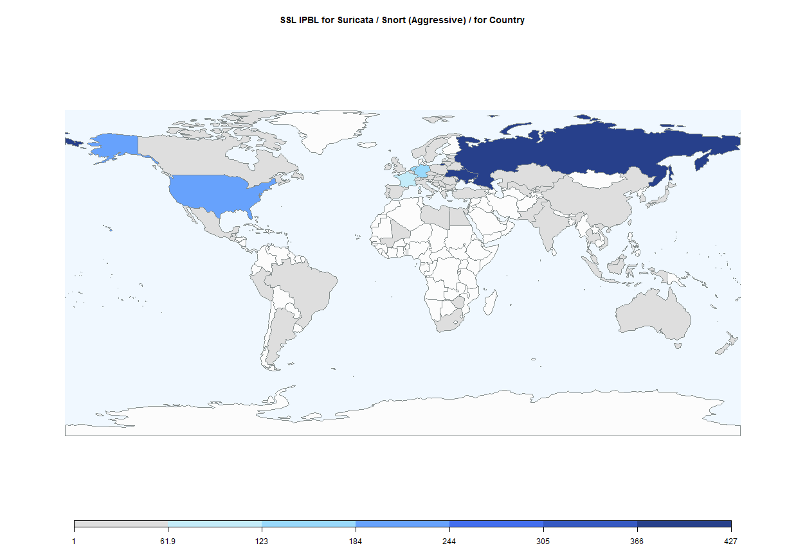

SSL Black List (SSLBL)
========================================================
By:
David Renjifo /
María Eugenia García /
María Eugenia Sánchez

## **Introduction**

Suricata / Snort Ruleset to detect and block bad SSL connections in your network.

Abuses **include** botnets, malware campaigns and banking malware.

Many entries are associated with networks based on popular bots and malware such as Zeus, Shylock and kinships attacks.

The origin source updates every 15 minutes.

**Objective**: Cross the black list obtained from the following [link](https://sslbl.abuse.ch/blacklist/sslipblacklist_aggressive.rules): base on the list of ip's by country to determine the origin of the attacks.

Ip's black list (SSLBL) can be used to compare with any ip's log and know who had visit a page, etc.


**The next table shows the black list.**


```
## 
## Attaching package: 'dplyr'
```

```
## The following objects are masked from 'package:stats':
## 
##     filter, lag
```

```
## The following objects are masked from 'package:base':
## 
##     intersect, setdiff, setequal, union
```

```
## ### Welcome to rworldmap ###
```

```
## For a short introduction type : 	 vignette('rworldmap')
```

```
## Error in library(knirt): there is no package called 'knirt'
```


```
##      ip_decimal              ip protocolo puerto
## 1    1540969744    91.217.85.16       tcp    443
## 2      86499070    5.39.222.254       tcp    443
## 3    2733867805  162.243.131.29       tcp    443
## 4    1605743281  95.181.178.177       tcp    443
## 5      86498948    5.39.222.132       tcp    443
## 6    1506889042    89.209.77.82       tcp    443
## 7    1045216779    62.76.190.11       tcp   8085
## 8    1315876232  78.110.173.136       tcp    443
## 9     628844047   37.123.102.15       tcp    443
## 10   3257898852  194.47.151.100       tcp    443
## 11    628843279    37.123.99.15       tcp    443
## 12   3234992358  192.210.16.230       tcp    443
## 13    918950761   54.198.19.105       tcp    443
## 14   3169940525  188.241.116.45       tcp  44913
## 15   3104709820   185.14.28.188       tcp    443
## 16   3325945619   198.61.231.19       tcp    443
## 17   1822664907 108.163.168.203       tcp    443
## 18   3179229195   189.127.48.11       tcp    443
## 19   2987713831   178.20.229.39       tcp    443
## 20   1836622139  109.120.161.59       tcp    443
## 21   1836622136  109.120.161.56       tcp    443
## 22   3135960586  186.234.246.10       tcp    443
## 23   1427740937     85.25.153.9       tcp    443
## 24    534513525    31.220.7.117       tcp    443
## 25   3169939640 188.241.112.184       tcp  41513
## 26   1311758139    78.47.215.59       tcp    443
## 27     86499006    5.39.222.190       tcp    443
## 28   2733872668  162.243.150.28       tcp    443
## 29   1540537718  91.210.189.118       tcp    443
## 30   3627709810  216.58.117.114       tcp    443
## 31   3349621431  199.167.42.183       tcp    443
## 32   1607937686   95.215.46.150       tcp    443
## 33   3652084973 217.174.100.237       tcp    443
## 34   1474355680  87.224.225.224       tcp    443
## 35   3624103740    216.3.111.60       tcp    443
## 36   1583636333   94.100.95.109       tcp    443
## 37   2732255569  162.218.233.81       tcp    443
## 38    624635722     37.59.47.74       tcp    443
## 39    918893002   54.197.49.202       tcp    443
## 40   3231823538 192.161.182.178       tcp    443
## 41   1426777156    85.10.228.68       tcp  59131
## 42   1495749529    89.39.83.153       tcp    443
## 43   3258606824  194.58.100.232       tcp    443
## 44   2987560463   178.18.142.15       tcp    443
## 45   3105526308   185.26.146.36       tcp    443
## 46   3106209160  185.36.253.136       tcp    443
## 47   1836622304 109.120.161.224       tcp    443
## 48   3231823574 192.161.182.214       tcp    443
## 49   1081655690  64.120.193.138       tcp    443
## 50   1605743600  95.181.179.240       tcp  32131
## 51   2307379445 137.135.208.245       tcp    443
## 52   3522031315 209.237.238.211       tcp    443
## 53   1807065489 107.181.161.145       tcp    443
## 54   3494713104    208.77.23.16       tcp    443
## 55   1542309437   91.237.198.61       tcp    443
## 56   1054000095  62.210.195.223       tcp     80
## 57   1045215518    62.76.185.30       tcp    443
## 58    633880951   37.200.65.119       tcp    443
## 59    629878746   37.139.47.218       tcp    443
## 60   1844205269  109.236.86.213       tcp  62201
## 61   1835579277 109.104.183.141       tcp    443
## 62   1587301658    94.156.77.26       tcp    443
## 63   3258605856    194.58.97.32       tcp    443
## 64    911303778    54.81.100.98       tcp    443
## 65   3104709767   185.14.28.135       tcp    443
## 66   3211068698    191.101.5.26       tcp    443
## 67    911418156     54.83.35.44       tcp    443
## 68   2499496011   148.251.72.75       tcp    443
## 69   1728810929  103.11.143.177       tcp    443
## 70   1045178679     62.76.41.55       tcp    443
## 71   3234222595    192.198.82.3       tcp    443
## 72   1836623344 109.120.165.240       tcp    443
## 73   1836622157  109.120.161.77       tcp    443
## 74   1836622158  109.120.161.78       tcp    443
## 75     88053937    5.63.152.177       tcp    443
## 76   1844276726 109.237.109.246       tcp    443
## 77   2790174245   166.78.174.37       tcp    443
## 78   1334329612    79.136.65.12       tcp    443
## 79   1317495179   78.135.97.139       tcp    443
## 80   2960843548  176.122.227.28       tcp    443
## 81   1047337193   62.109.24.233       tcp    443
## 82    622484958    37.26.93.222       tcp    443
## 83   3211067742    191.101.1.94       tcp    443
## 84   2734135926 162.247.154.118       tcp    443
## 85   2734135925 162.247.154.117       tcp    443
## 86   3039414067   181.41.199.51       tcp    443
## 87   2420963694  144.76.249.110       tcp    443
## 88   3731803414  222.110.205.22       tcp    443
## 89   3585063062 213.175.184.150       tcp    443
## 90   1427727155     85.25.99.51       tcp    443
## 91    635722898   37.228.92.146       tcp    443
## 92   3275626991   195.62.25.239       tcp    443
## 93   3166598467  188.190.117.67       tcp    443
## 94   2996827660  178.159.246.12       tcp    443
## 95   1572644272  93.188.165.176       tcp    443
## 96   1357940004   80.240.133.36       tcp    443
## 97    391756842    23.89.188.42       tcp    443
## 98   2461661207  146.185.248.23       tcp    443
## 99   3325209379   198.50.171.35       tcp    443
## 100  2372486606  141.105.69.206       tcp    443
## 101   773604518    46.28.68.166       tcp    443
## 102  3246133384  193.124.16.136       tcp    443
## 103  1815987821  108.61.198.109       tcp    443
## 104  1836626989  109.120.180.45       tcp    443
## 105  1836629509   109.120.190.5       tcp    443
## 106  1836626990  109.120.180.46       tcp    443
## 107  2987712873  178.20.225.105       tcp    443
## 108   911758078    54.88.82.254       tcp    443
## 109  3169947017 188.241.141.137       tcp    443
## 110  1467561042    87.121.52.82       tcp    443
## 111  1108862539    66.23.230.75       tcp    443
## 112  1047337213   62.109.24.253       tcp    443
## 113  2365941263    141.5.102.15       tcp    443
## 114   402574255  23.254.203.175       tcp    443
## 115  1841826627   109.200.11.67       tcp    443
## 116    86161317    5.34.183.165       tcp    443
## 117  3275626991   195.62.25.239       tcp    443
## 118  1045213867   62.76.178.171       tcp    443
## 119  1386578429  82.165.129.253       tcp   1863
## 120  2732369668   162.220.167.4       tcp    443
## 121  3428803532   204.95.99.204       tcp    443
## 122  1836619465 109.120.150.201       tcp    443
## 123  1836619391 109.120.150.127       tcp    443
## 124  2509914441   149.154.65.73       tcp    443
## 125  1836626997  109.120.180.53       tcp    443
## 126   532703545   31.192.105.57       tcp    443
## 127  3227464614   192.95.51.166       tcp    443
## 128  3428803533   204.95.99.205       tcp    443
## 129  1502613028    89.144.14.36       tcp    443
## 130  1294487805    77.40.80.253       tcp    443
## 131   522836720   31.41.218.240       tcp    443
## 132  2356521579 140.117.170.107       tcp    443
## 133  2789178594  166.63.124.226       tcp    443
## 134  2790166608   166.78.144.80       tcp    443
## 135  3104709790   185.14.28.158       tcp    443
## 136  2990534334  178.63.238.190       tcp    443
## 137  1145515397    68.71.45.133       tcp    443
## 138  1541887406   91.231.85.174       tcp    443
## 139  1475138437  87.236.211.133       tcp    443
## 140  3162041507 188.120.236.163       tcp    443
## 141  3105453307  185.25.116.251       tcp    443
## 142   522836721   31.41.218.241       tcp    443
## 143  3235043078   192.210.215.6       tcp    443
## 144  3169940711 188.241.116.231       tcp    443
## 145   392105855    23.95.15.127       tcp    443
## 146   401573226  23.239.133.106       tcp    443
## 147  1836627561 109.120.182.105       tcp    443
## 148  2449492149    146.0.72.181       tcp    443
## 149  1836625403 109.120.173.251       tcp    443
## 150   624639355    37.59.61.123       tcp    443
## 151  1385309189     82.146.36.5       tcp  11039
## 152  1047335403   62.109.17.235       tcp    443
## 153  3163205920  188.138.177.32       tcp    443
## 154  1571448969  93.170.104.137       tcp    443
## 155  2549644724 151.248.125.180       tcp    443
## 156  3258607238  194.58.102.134       tcp    443
## 157  1836626428 109.120.177.252       tcp    443
## 158  3275790968  195.64.154.120       tcp    443
## 159  1385309159   82.146.35.231       tcp    443
## 160    86498971    5.39.222.155       tcp    443
## 161   522836705   31.41.218.225       tcp    443
## 162   392061240     23.94.97.56       tcp    443
## 163  1114720900   66.113.74.132       tcp    443
## 164  1815950254   108.61.51.174       tcp    443
## 165  2984904890   177.234.8.186       tcp    443
## 166  1571532016  93.171.172.240       tcp  52009
## 167  3494655012    208.76.52.36       tcp    443
## 168  1844205243  109.236.86.187       tcp  57016
## 169  2790134476   166.78.18.204       tcp    443
## 170  1836627847 109.120.183.135       tcp    443
## 171  1403783363    83.172.8.195       tcp    443
## 172  2731768197 162.211.121.133       tcp    443
## 173  3104710342   185.14.30.198       tcp    443
## 174  1540294166     91.207.6.22       tcp  40601
## 175  2956268420   176.53.19.132       tcp    443
## 176  3246140581  193.124.44.165       tcp    443
## 177   629982099  37.140.195.147       tcp    443
## 178   522174496    31.31.192.32       tcp    443
## 179    86161374    5.34.183.222       tcp    443
## 180  3585555131  213.183.58.187       tcp    443
## 181  3258605618    194.58.96.50       tcp    443
## 182  1807068756  107.181.174.84       tcp    443
## 183  1592969061  94.242.199.101       tcp  61111
## 184  3235041352  192.210.208.72       tcp    443
## 185  3106783483  185.45.192.251       tcp  49010
## 186  1509810486   89.253.225.54       tcp    443
## 187  1467370118   87.118.74.134       tcp    443
## 188  3249100462  193.169.86.174       tcp  21793
## 189  3246133258   193.124.16.10       tcp    443
## 190  2734376325  162.251.69.133       tcp    443
## 191   624637213     37.59.53.29       tcp    443
## 192  2549645002 151.248.126.202       tcp    443
## 193  1834434238   109.87.62.190       tcp    443
## 194  3258607054  194.58.101.206       tcp    443
## 195  1836627087 109.120.180.143       tcp    443
## 196  3258607051  194.58.101.203       tcp    443
## 197  1558092189  92.222.153.157       tcp    443
## 198  3104710341   185.14.30.197       tcp    443
## 199  3104455070   185.10.57.158       tcp    443
## 200   534516036    31.220.17.68       tcp    443
## 201  3258607043  194.58.101.195       tcp    443
## 202  3256659577  194.28.174.121       tcp    443
## 203  3246140580  193.124.44.164       tcp    443
## 204  1509811381  89.253.228.181       tcp    443
## 205  1583756717   94.102.53.173       tcp    443
## 206  1839458710 109.163.233.150       tcp    443
## 207  1839458711 109.163.233.151       tcp    443
## 208  2992141274  178.88.115.218       tcp    443
## 209  2247242347  133.242.50.107       tcp    443
## 210  3246140582  193.124.44.166       tcp    443
## 211  2549642949 151.248.118.197       tcp    443
## 212  2461661206  146.185.248.22       tcp    443
## 213  1844205276  109.236.86.220       tcp  65499
## 214  1836623124  109.120.165.20       tcp    443
## 215  1307918924    77.245.66.76       tcp    443
## 216  2953425396   176.9.177.244       tcp   1890
## 217  3287870427 195.248.235.219       tcp    443
## 218  3169039187  188.227.179.83       tcp  41573
## 219  1836627644 109.120.182.188       tcp    443
## 220  1836626287 109.120.177.111       tcp    443
## 221  1541072392    91.218.230.8       tcp  29200
## 222  1836625246  109.120.173.94       tcp    443
## 223  3164982482 188.165.204.210       tcp    443
## 224  1294497681   77.40.119.145       tcp    443
## 225  2513603796 149.210.140.212       tcp    443
## 226  1047335156   62.109.16.244       tcp    443
## 227  1844205276  109.236.86.220       tcp  37707
## 228  1578626102    94.23.236.54       tcp    443
## 229  1223174613   72.232.41.213       tcp    443
## 230  3258607496  194.58.103.136       tcp    443
## 231  1836623053 109.120.164.205       tcp    443
## 232  3258607528  194.58.103.168       tcp    443
## 233  1346719204    80.69.77.228       tcp    443
## 234  1306366274   77.221.145.66       tcp    443
## 235  2994506895 178.124.140.143       tcp    443
## 236  3258593047    194.58.47.23       tcp    443
## 237  3258608758  194.58.108.118       tcp    443
## 238  3641493300   217.12.199.52       tcp    443
## 239  3105153066   185.20.224.42       tcp    443
## 240  2732329080   162.220.8.120       tcp    443
## 241  2549641824  151.248.114.96       tcp    443
## 242  1053994118  62.210.172.134       tcp    443
## 243   635722667   37.228.91.171       tcp    443
## 244  3258607591  194.58.103.231       tcp    443
## 245  3323686573  198.27.110.173       tcp   4881
## 246  3258607510  194.58.103.150       tcp    443
## 247  1815949598    108.61.49.30       tcp    443
## 248  1547658456   92.63.100.216       tcp    443
## 249   624624267     37.59.2.139       tcp    443
## 250  1815950246   108.61.51.166       tcp    443
## 251   522177429   31.31.203.149       tcp    443
## 252  1604549073  95.163.121.209       tcp    443
## 253  3164986891  188.165.222.11       tcp    443
## 254   773728790     46.30.42.22       tcp    443
## 255  3104821476  185.15.208.228       tcp  37189
## 256  1578574780    94.23.35.188       tcp    443
## 257  3162045759  188.120.253.63       tcp    443
## 258  1306366297   77.221.145.89       tcp    443
## 259  1306366293   77.221.145.85       tcp    443
## 260  3164994448 188.165.251.144       tcp   4443
## 261   624635442     37.59.46.50       tcp    443
## 262  1090199466   64.251.31.170       tcp   4443
## 263  1578574780    94.23.35.188       tcp   4443
## 264  1844205277  109.236.86.221       tcp  55999
## 265   635722668   37.228.91.172       tcp    443
## 266  1572757494   93.190.95.246       tcp  44373
## 267  3325714225    198.58.95.49       tcp     80
## 268    84503203     5.9.106.163       tcp    443
## 269   782310928    46.161.30.16       tcp    443
## 270  3352047045  199.204.45.197       tcp   8586
## 271  2959309251  176.99.121.195       tcp    443
## 272  1266614885    75.127.2.101       tcp    443
## 273  3589260431 213.239.196.143       tcp    443
## 274  1607720910  95.211.223.206       tcp  38193
## 275   624635442     37.59.46.50       tcp   4443
## 276  3164988197  188.165.227.37       tcp   4443
## 277  1836627370 109.120.181.170       tcp    443
## 278  3105286282  185.22.232.138       tcp    443
## 279  3105286282  185.22.232.138       tcp    443
## 280  2684162919  159.253.19.103       tcp    443
## 281  3164994448 188.165.251.144       tcp    443
## 282   778664576  46.105.122.128       tcp    443
## 283  1578630184    94.23.252.40       tcp   4443
## 284  3164934157   188.165.16.13       tcp    443
## 285   778658415   46.105.98.111       tcp    443
## 286  3093250018   184.95.63.226       tcp    443
## 287  3164988197  188.165.227.37       tcp    443
## 288   778658415   46.105.98.111       tcp   4443
## 289  1540745670  91.213.233.198       tcp    443
## 290  3104126087    185.5.52.135       tcp    443
## 291  2382342008 141.255.167.120       tcp    443
## 292  1572757491   93.190.95.243       tcp  38043
## 293   700010001    41.185.78.17       tcp    443
## 294  3246141021   193.124.46.93       tcp    443
## 295    92762012   5.135.111.156       tcp  58943
## 296  2509915666   149.154.70.18       tcp    443
## 297   782310931    46.161.30.19       tcp    443
## 298   781661521    46.151.53.81       tcp    443
## 299  3246153423  193.124.94.207       tcp    443
## 300  1308004899   77.246.146.35       tcp  27564
## 301  3568255558   212.175.66.70       tcp    443
## 302  1297216682   77.81.244.170       tcp  65529
## 303   782310933    46.161.30.21       tcp    443
## 304    86445986     5.39.15.162       tcp    443
## 305   778943278   46.109.187.46       tcp    443
## 306  1045215560    62.76.185.72       tcp    443
## 307  1049436897   62.141.34.225       tcp    443
## 308    99042290    5.231.67.242       tcp    443
## 309  3107820934  185.61.149.134       tcp    443
## 310   782310934    46.161.30.22       tcp    443
## 311   782310935    46.161.30.23       tcp    443
## 312   624641033      37.59.68.9       tcp   8586
## 313  1572757491   93.190.95.243       tcp  38143
## 314   782310936    46.161.30.24       tcp    443
## 315   782310938    46.161.30.26       tcp    443
## 316  3236015966  192.225.175.94       tcp    443
## 317   782310939    46.161.30.27       tcp    443
## 318  1572757494   93.190.95.246       tcp  48383
## 319   782310952    46.161.30.40       tcp    443
## 320  3473693149   207.12.89.221       tcp    443
## 321   782310953    46.161.30.41       tcp    443
## 322  1571455566   93.170.130.78       tcp    443
## 323   825424688    49.50.251.48       tcp    443
## 324   782310954    46.161.30.42       tcp    443
## 325   529849530  31.148.220.186       tcp     80
## 326   782310955    46.161.30.43       tcp    443
## 327  1495307580    89.32.149.60       tcp  65398
## 328   635722672   37.228.91.176       tcp    443
## 329  3171048169    189.2.90.233       tcp    443
## 330  2959279673     176.99.6.57       tcp    443
## 331   782310958    46.161.30.46       tcp    443
## 332   620873763     37.1.200.35       tcp   3443
## 333  3107079318   185.50.68.150       tcp    443
## 334  3162503569 188.127.249.145       tcp  54794
## 335   635721903   37.228.88.175       tcp    443
## 336  1566532125     93.95.98.29       tcp    443
## 337  1572757360   93.190.95.112       tcp  35133
## 338  3107978635  185.63.253.139       tcp    443
## 339  1047337165   62.109.24.205       tcp    443
## 340  1566532146     93.95.98.50       tcp    443
## 341  1310433136   78.27.159.112       tcp    443
## 342  3162814294  188.132.183.86       tcp    443
## 343  3281714302 195.154.252.126       tcp  40601
## 344  2988524273   178.33.66.241       tcp     80
## 345  1572757360   93.190.95.112       tcp  38553
## 346  1509692357   89.252.19.197       tcp    443
## 347  1600738357    95.105.84.53       tcp    443
## 348  1410538443    84.19.27.203       tcp  42311
## 349  3105453908   185.25.119.84       tcp    443
## 350  1427736091    85.25.134.27       tcp    443
## 351   783113947   46.173.94.219       tcp    443
## 352   622424266   37.25.112.202       tcp    443
## 353    95412528    5.175.225.48       tcp     80
## 354    95412528    5.175.225.48       tcp    443
## 355   635722940   37.228.92.188       tcp    443
## 356  1486283892  88.150.228.116       tcp  38553
## 357  1486276008  88.150.197.168       tcp  42613
## 358  1592282521   94.232.77.153       tcp    443
## 359  1834433093    109.87.58.69       tcp    443
## 360  1486817670    88.159.9.134       tcp    443
## 361  1385313450   82.146.52.170       tcp    443
## 362  1297216577    77.81.244.65       tcp  43894
## 363  2978055934 177.129.134.254       tcp    443
## 364  1495307612    89.32.149.92       tcp  42613
## 365  3169939544  188.241.112.88       tcp  39316
## 366   773604494    46.28.68.142       tcp    443
## 367  1358151385  80.243.190.217       tcp  39817
## 368  1410538429    84.19.27.189       tcp  42613
## 369  1439088122  85.198.189.250       tcp    443
## 370  1047275726   62.108.40.206       tcp  42613
## 371  1047275737   62.108.40.217       tcp  42253
## 372  1486283874   88.150.228.98       tcp  37818
## 373  1603257906   95.143.198.50       tcp     80
## 374  1603257906   95.143.198.50       tcp    443
## 375  3162044817 188.120.249.145       tcp    443
## 376  1541788177   91.229.210.17       tcp    443
## 377  1481988388     88.85.89.36       tcp    443
## 378  1540314834   91.207.86.210       tcp    443
## 379  1542802555   91.245.76.123       tcp    443
## 380  1558057704   92.222.18.232       tcp    443
## 381  1760298318    104.236.5.78       tcp    443
## 382  3105453367   185.25.117.55       tcp    443
## 383  3253441382 193.235.147.102       tcp    443
## 384  3211099298 191.101.124.162       tcp    443
## 385  1500272674    89.108.88.34       tcp    443
## 386   528501348   31.128.74.100       tcp    443
## 387   788141758   46.250.22.190       tcp    443
## 388  3107896596   185.62.189.20       tcp    443
## 389  1136098199  67.183.123.151       tcp    443
## 390  2194447633  130.204.157.17       tcp    443
## 391  3136290684 186.239.255.124       tcp    443
## 392  1385248656   82.145.55.144       tcp    443
## 393  1541561643    91.226.93.43       tcp    443
## 394  1571506594   93.171.73.162       tcp    443
## 395  3109440606    185.86.76.94       tcp    443
## 396   622421541    37.25.102.37       tcp    443
## 397  1308005292  77.246.147.172       tcp    443
## 398  1565495986   93.79.146.178       tcp    443
## 399  3104710299   185.14.30.155       tcp    443
## 400  3550318550 211.157.143.214       tcp    443
## 401  3106999407   185.49.12.111       tcp    443
## 402  2988521439   178.33.55.223       tcp    443
## 403  1540538260  91.210.191.148       tcp    443
## 404  3382796546    201.161.97.2       tcp    443
## 405  1553279285    92.149.41.53       tcp    443
## 406  3104543455  185.11.146.223       tcp    443
## 407  2987712655  178.20.224.143       tcp    443
## 408   628843405   37.123.99.141       tcp    443
## 409  1542345552    91.238.83.80       tcp    443
## 410  1380144867    82.67.86.227       tcp    443
## 411  1547146052    92.55.147.68       tcp    443
## 412  3156934649  188.42.255.249       tcp    443
## 413  3024813342   180.74.253.30       tcp   9999
## 414  3162828712 188.132.239.168       tcp    443
## 415   533887763   31.210.123.19       tcp    443
## 416  1102413500  65.181.126.188       tcp    443
## 417  1045214075   62.76.179.123       tcp    443
## 418  3651175504  217.160.132.80       tcp    443
## 419  3563969286   212.109.219.6       tcp    443
## 420  1385311616   82.146.45.128       tcp    443
## 421  1833603602   109.74.146.18       tcp   1443
## 422   629983076  37.140.199.100       tcp   8443
## 423  1294479074    77.40.46.226       tcp    443
## 424  1051562452  62.173.145.212       tcp    443
## 425   910506066     54.69.56.82       tcp    443
## 426  1571449136   93.170.105.48       tcp    443
## 427  1571449130   93.170.105.42       tcp    443
## 428   533887773   31.210.123.29       tcp    443
## 429   773639737    46.28.206.57       tcp    443
## 430  3000687945  178.218.221.73       tcp   8443
## 431  1489422725  88.198.201.133       tcp    443
## 432  1310251706   78.24.218.186       tcp   8443
## 433  1495028708    89.28.83.228       tcp   8443
## 434  3108128301    185.66.70.45       tcp   8443
## 435  3168966285 188.226.150.141       tcp   1443
## 436   774167328    46.36.219.32       tcp   1443
## 437  1385315032   82.146.58.216       tcp   8443
## 438  3105518477  185.26.115.141       tcp    443
## 439    86866803    5.45.123.115       tcp   1443
## 440  3104595903   185.12.95.191       tcp   4443
## 441    86867070    5.45.124.126       tcp   1443
## 442  1050158170    62.152.36.90       tcp   1443
## 443  2420918531     144.76.73.3       tcp   1443
## 444  2509914182   149.154.64.70       tcp   4443
## 445  3109210643   185.82.202.19       tcp     80
## 446  1502610068    89.144.2.148       tcp    443
## 447  1605743270  95.181.178.166       tcp    443
## 448  1754392953 104.145.233.121       tcp   8586
## 449    86866840    5.45.123.152       tcp   1443
## 450  2264472943  134.249.29.111       tcp    443
## 451  3109210644   185.82.202.20       tcp    443
## 452   521674305     31.24.30.65       tcp    443
## 453  3256637309   194.28.87.125       tcp   4443
## 454   774167011   46.36.217.227       tcp   3443
## 455  3104414762    185.9.156.42       tcp    443
## 456  2954854523  176.31.128.123       tcp    443
## 457  3571669430  212.227.89.182       tcp   3443
## 458  1604549002  95.163.121.138       tcp    443
## 459    86825004     5.44.216.44       tcp   1443
## 460  2249438286   134.19.180.78       tcp    443
## 461   991741611   59.28.198.171       tcp    443
## 462    86444244      5.39.8.212       tcp     80
## 463  3106296891    185.38.84.59       tcp    443
## 464  1542068340   91.234.24.116       tcp    443
## 465  1467344157   87.117.229.29       tcp    443
## 466  3105518349   185.26.115.13       tcp    443
## 467  3580856874  213.111.138.42       tcp    443
## 468  3106541459   185.42.15.147       tcp    443
## 469  1541086612   91.219.29.148       tcp    443
## 470  2916524632  173.214.162.88       tcp    443
## 471   737759573    43.249.81.85       tcp    443
## 472  2684163188  159.253.20.116       tcp   4443
## 473  2539779036  151.97.243.220       tcp    443
## 474  3109793630   185.91.175.94       tcp    443
## 475   630132596   37.143.15.116       tcp   4433
## 476   774167011   46.36.217.227       tcp   3443
## 477  1311749851   78.47.182.219       tcp    443
## 478   773728665    46.30.41.153       tcp    443
## 479  2457366163 146.120.110.147       tcp    443
## 480  3109793541    185.91.175.5       tcp    443
## 481  1541071897   91.218.228.25       tcp   8443
## 482  1311710195    78.47.27.243       tcp    443
## 483  2548881662 151.236.216.254       tcp   2443
## 484  1645973984   98.27.145.224       tcp    443
## 485  3104815561  185.15.185.201       tcp   4443
## 486    88054500    5.63.154.228       tcp   5443
## 487  3105517887   185.26.113.63       tcp    443
## 488    90823951    5.105.221.15       tcp    443
## 489  1592933010   94.242.58.146       tcp   4433
## 490  1311652995    78.46.60.131       tcp   4443
## 491  2954829050   176.31.28.250       tcp    443
## 492  1311749854   78.47.182.222       tcp    443
## 493  3104569314  185.11.247.226       tcp   8443
## 494  1299898757  77.122.225.133       tcp    443
## 495  1805720473  107.161.27.153       tcp    443
## 496  1984284948   118.69.201.20       tcp   1443
## 497  3002791708  178.250.247.28       tcp   8443
## 498  1540852332  91.215.138.108       tcp    443
## 499  1540330124  91.207.146.140       tcp    443
## 500  2988461741   178.32.78.173       tcp    443
## 501  2186843210   130.88.148.74       tcp    443
## 502  3631715159  216.119.147.87       tcp   2443
## 503  1604549001  95.163.121.137       tcp    443
## 504  1054004985  62.210.214.249       tcp   1443
## 505  2461654303  146.185.221.31       tcp    443
## 506  1578585499    94.23.77.155       tcp    443
## 507   100559579   5.254.106.219       tcp   9866
## 508  2420960982  144.76.238.214       tcp   4443
## 509  1045179503    62.76.44.111       tcp    443
## 510  3166624616 188.190.219.104       tcp    443
## 511  2248176541   134.0.115.157       tcp   8443
## 512  1045217108    62.76.191.84       tcp   5443
## 513  2988455291   178.32.53.123       tcp    443
## 514  1358068624  80.242.123.144       tcp    443
## 515    90503639   5.100.249.215       tcp    443
## 516  1055931693    62.240.61.45       tcp    443
## 517  2987713329   178.20.227.49       tcp    443
## 518  1299958355   77.123.202.83       tcp    443
## 519  1806303693   107.170.1.205       tcp   8443
## 520  2461630690 146.185.128.226       tcp   8443
## 521   532308986   31.186.99.250       tcp   8443
## 522  3109793695  185.91.175.159       tcp    443
## 523  1299957006   77.123.197.14       tcp    443
## 524   529849241  31.148.219.153       tcp     80
## 525  1299855013   77.122.54.165       tcp    443
## 526  3562861377   212.92.243.65       tcp    443
## 527   629982129  37.140.195.177       tcp   7443
## 528   628341527   37.115.187.23       tcp    443
## 529  1475139479  87.236.215.151       tcp     80
## 530  3109871044  185.92.221.196       tcp    443
## 531  3104595752    185.12.95.40       tcp   7443
## 532  1176521324    70.32.74.108       tcp   7443
## 533  3415694968  203.151.94.120       tcp   4433
## 534  3162044903 188.120.249.231       tcp   8443
## 535  2955307524    176.38.106.4       tcp    443
## 536  1539587991   91.196.63.151       tcp    443
## 537  1729882277  103.27.232.165       tcp    443
## 538  1334820755  79.143.191.147       tcp   6443
## 539    92740725    5.135.28.117       tcp    443
## 540  1311737903    78.47.136.47       tcp    443
## 541  2917565100 173.230.130.172       tcp   2443
## 542  3509112551  209.40.206.231       tcp   8443
## 543  1311749847   78.47.182.215       tcp    443
## 544  1541561633    91.226.93.33       tcp    443
## 545  3652086043  217.174.105.27       tcp    443
## 546  1578579223     94.23.53.23       tcp   2443
## 547  1311710386    78.47.28.178       tcp    443
## 548  3580873675 213.111.203.203       tcp    443
## 549   533710046  31.207.196.222       tcp    443
## 550  1192100235     71.14.1.139       tcp   8443
## 551  2264526476 134.249.238.140       tcp    443
## 552   533888490  31.210.125.234       tcp    443
## 553  1587102201   94.153.65.249       tcp    443
## 554  2090631453  124.156.129.29       tcp    443
## 555  1475139486  87.236.215.158       tcp   8685
## 556  2297630350  136.243.14.142       tcp   8443
## 557  3238891019   193.13.142.11       tcp   8443
## 558  3108107975  185.65.246.199       tcp    443
## 559  2156369395 128.135.149.243       tcp    443
## 560   630131621   37.143.11.165       tcp   4443
## 561    92740716    5.135.28.108       tcp    443
## 562  2953416563   176.9.143.115       tcp   2443
## 563  1845377635   109.254.58.99       tcp    443
## 564  3109440592    185.86.76.80       tcp    443
## 565  3282670415  195.169.147.79       tcp   1443
## 566  1311749844   78.47.182.212       tcp    443
## 567  1466084819   87.98.173.211       tcp    443
## 568  1572643357   93.188.162.29       tcp    443
## 569  1279963601   76.74.177.209       tcp   8443
## 570  3000351610 178.213.187.122       tcp    443
## 571  1449771885  86.105.195.109       tcp    443
## 572  1565397888    93.78.19.128       tcp    443
## 573  3169193919  188.230.15.191       tcp    443
## 574  2995309877  178.136.205.53       tcp    443
## 575  3109133159  185.81.155.103       tcp    443
## 576  1596922997    95.47.28.117       tcp    443
## 577  3562858436  212.92.231.196       tcp    443
## 578  3169211437   188.230.84.45       tcp    443
## 579  3106541464   185.42.15.152       tcp    443
## 580  2987713328   178.20.227.48       tcp    443
## 581   533388428  31.202.220.140       tcp    443
## 582  1427762696     85.25.238.8       tcp   1443
## 583  3156781722  188.40.170.154       tcp     80
## 584  3279069118 195.114.159.190       tcp    443
## 585   635821809  37.229.222.241       tcp    443
## 586  3107896858   185.62.190.26       tcp    443
## 587  3000183215  178.211.41.175       tcp    443
## 588  3104710081   185.14.29.193       tcp    443
## 589  1317615415    78.137.55.55       tcp    443
## 590  1311738682    78.47.139.58       tcp    843
## 591  3075581445    183.81.166.5       tcp    443
## 592  1991153435  118.174.151.27       tcp    943
## 593    86455499     5.39.52.203       tcp    443
## 594  2960111629  176.111.184.13       tcp    443
## 595   773032147   46.19.136.211       tcp    443
## 596  1542719956    91.244.9.212       tcp    443
## 597  2988460256   178.32.72.224       tcp    443
## 598    88055344     5.63.158.48       tcp    443
## 599   635768162    37.229.13.98       tcp    443
## 600  1476275556   87.254.45.100       tcp   1443
## 601  3168970283  188.226.166.43       tcp    448
## 602  1571552667  93.171.253.155       tcp    443
## 603  2996214034  178.150.153.18       tcp    443
## 604  1625522556  96.227.129.124       tcp    443
## 605  1299819543   77.121.172.23       tcp    443
## 606  1168430421   69.164.213.85       tcp   1443
## 607  3560395856    212.55.84.80       tcp    443
## 608    83959480      5.1.30.184       tcp    443
## 609   779562618   46.119.46.122       tcp    443
## 610  1045757370   62.84.253.186       tcp    443
## 611   782674771   46.166.171.83       tcp   9999
## 612  1358755353   80.252.246.25       tcp    443
## 613  3555068900  211.230.11.228       tcp    443
## 614  1833466040  109.72.120.184       tcp    443
## 615   628843944  37.123.101.168       tcp    443
## 616  1054004842  62.210.214.106       tcp    448
## 617  2954627837   176.28.10.253       tcp   8443
## 618  3564269035 212.114.109.235       tcp    443
## 619  3106379106   185.39.149.98       tcp    443
## 620  2953410249   176.9.118.201       tcp    449
## 621  2959279626     176.99.6.10       tcp   8443
## 622  2996290877  178.151.197.61       tcp    443
## 623  1359550714     81.9.24.250       tcp    443
## 624  1311766675   78.47.248.147       tcp     80
## 625  1311739860   78.47.143.212       tcp    443
## 626  1844260617    109.237.47.9       tcp    443
## 627   624196400    37.52.123.48       tcp    443
## 628    96795067   5.196.249.187       tcp    443
## 629  3001847557   178.236.143.5       tcp    443
## 630   781661284   46.151.52.100       tcp    443
## 631   628842680   37.123.96.184       tcp    443
## 632  2538605122    151.80.10.66       tcp    443
## 633  3234332333 192.199.254.173       tcp   8080
## 634  1534680029   91.121.91.221       tcp   1443
## 635  2549644132 151.248.123.100       tcp    743
## 636    95572585    5.178.82.105       tcp    443
## 637  3536935330  210.209.89.162       tcp   8080
## 638  3156781725  188.40.170.157       tcp     80
## 639  3156781725  188.40.170.157       tcp    443
## 640  1539954478   91.201.215.46       tcp    443
## 641  1449726578   86.105.18.114       tcp    443
## 642  3258605613    194.58.96.45       tcp   4543
## 643  1604549116  95.163.121.252       tcp    443
## 644  2733837326   162.243.12.14       tcp    449
## 645  3160230234    188.93.73.90       tcp    449
## 646  3354468073  199.241.30.233       tcp    449
## 647  1578593837    94.23.110.45       tcp    443
## 648  1151939029   68.169.49.213       tcp    448
## 649  1834411730  109.86.230.210       tcp    443
## 650  3109261474  185.83.144.162       tcp    443
## 651  1571528391  93.171.158.199       tcp    443
## 652  1427752950   85.25.199.246       tcp    543
## 653   528743201   31.131.251.33       tcp    743
## 654  2420959291   144.76.232.59       tcp    443
## 655  2996263320  178.151.89.152       tcp    443
## 656  1311678535    78.46.160.71       tcp    443
## 657  1571521541    93.171.132.5       tcp    743
## 658  3108107282   185.65.244.18       tcp    443
## 659  2995384978 178.137.242.146       tcp    443
## 660  1835580739  109.104.189.67       tcp    443
## 661  2297682930 136.243.219.242       tcp    443
## 662  1539991838   91.202.105.30       tcp    443
## 663  2461659907   146.185.243.3       tcp    443
## 664  1541072709   91.218.231.69       tcp    443
## 665  1316179733    78.115.79.21       tcp    443
## 666  1489377628    88.198.25.92       tcp    443
## 667   774167437   46.36.219.141       tcp    448
## 668  1317614767   78.137.52.175       tcp    443
## 669   620826881       37.1.17.1       tcp    443
## 670  1571462095  93.170.155.207       tcp    443
## 671  3258609565  194.58.111.157       tcp    448
## 672  1541887096   91.231.84.120       tcp    448
## 673  2499517844 148.251.157.148       tcp    443
## 674  1358424338   80.247.233.18       tcp   1443
## 675  1358263750  80.245.117.198       tcp    443
## 676  2960004855  176.110.22.247       tcp    443
## 677  2960004855  176.110.22.247       tcp    443
## 678  3163178819   188.138.71.67       tcp    443
## 679  1541219546   91.221.36.218       tcp    443
## 680  1358756501  80.252.250.149       tcp    443
## 681  3559900309  212.47.196.149       tcp    543
## 682  3156781723  188.40.170.155       tcp     80
## 683  3156781723  188.40.170.155       tcp    443
## 684  2960255770  176.113.235.26       tcp    443
## 685  2953334450    176.8.78.178       tcp    443
## 686  2533373183    151.0.52.255       tcp    443
## 687  1491256559  88.226.196.239       tcp    443
## 688  1744590226  103.252.85.146       tcp    443
## 689  2001819546   119.81.87.154       tcp    443
## 690  1844060858  109.234.34.186       tcp    443
## 691  1833466040  109.72.120.184       tcp    443
## 692   772447074    46.10.155.98       tcp    443
## 693  1505299694   89.185.12.238       tcp    443
## 694  1495351471    89.33.64.175       tcp    443
## 695  1834466218  109.87.187.170       tcp    443
## 696  3107291892  185.53.130.244       tcp    443
## 697  1041245827    62.16.38.131       tcp    443
## 698  1534677617   91.121.82.113       tcp   1443
## 699  3166588151  188.190.76.247       tcp    443
## 700  3281697008 195.154.184.240       tcp   1443
## 701   237050176     14.33.25.64       tcp    443
## 702   782254810   46.160.66.218       tcp    443
## 703  3582068887   213.130.8.151       tcp    443
## 704  3383693603   201.175.17.35       tcp    448
## 705  1077582980   64.58.156.132       tcp    443
## 706  3580859811 213.111.149.163       tcp    443
## 707  1299819803   77.121.173.27       tcp    443
## 708  1464612856    87.76.55.248       tcp    443
## 709  2365632910   141.0.177.142       tcp    443
## 710  2960273180   176.114.47.28       tcp    443
## 711   839371466    50.7.202.202       tcp    443
## 712  1249362450   74.119.194.18       tcp    448
## 713  2989944393   178.54.238.73       tcp    443
## 714   779525804  46.118.158.172       tcp    443
## 715   779514115    46.118.113.3       tcp    443
## 716  3156934209   188.42.254.65       tcp    443
## 717  1600780580   95.105.249.36       tcp    443
## 718  3564369114 212.115.244.218       tcp    443
## 719  1534660577   91.121.15.225       tcp   1443
## 720   528708407   31.131.115.55       tcp    443
## 721   522927384     31.43.61.24       tcp    443
## 722   783240214    46.175.76.22       tcp    443
## 723  2264471752  134.249.24.200       tcp    443
## 724  3642165113    217.23.7.121       tcp    443
## 725  1050158105    62.152.36.25       tcp   1443
## 726  1571441894   93.170.76.230       tcp    443
## 727   528829555   31.133.76.115       tcp    443
## 728  2907136740   173.71.98.228       tcp    443
## 729  2907136740   173.71.98.228       tcp    443
## 730  1311733589    78.47.119.85       tcp    543
## 731  1602682665   95.134.255.41       tcp    443
## 732   788166887  46.250.120.231       tcp    443
## 733    96789299    5.196.227.51       tcp    443
## 734  1123071763   66.240.183.19       tcp    843
## 735  1539939168   91.201.155.96       tcp    443
## 736   522937890    31.43.102.34       tcp    443
## 737  3281697008 195.154.184.240       tcp   1443
## 738  3645880435  217.79.184.115       tcp    443
## 739   100164532    5.248.99.180       tcp    443
## 740   779499018    46.118.54.10       tcp    443
## 741  2996281743 178.151.161.143       tcp    443
## 742   528708407   31.131.115.55       tcp    443
## 743   624514701    37.57.86.141       tcp    443
## 744  2955193915   176.36.174.59       tcp    443
## 745  2959737382    176.106.2.38       tcp    443
## 746   522793736      31.41.51.8       tcp    443
## 747    94027455   5.154.190.191       tcp    443
## 748  1206013496    71.226.78.56       tcp    443
## 749  1299839085  77.121.248.109       tcp    443
## 750   775893950    46.63.51.190       tcp    443
## 751  3274077443    195.38.117.3       tcp    443
## 752   779552691    46.119.7.179       tcp    443
## 753  3000558096  178.216.226.16       tcp    443
## 754   737910447  43.251.158.175       tcp    443
## 755  1839357796  109.162.95.100       tcp    443
## 756  3111188829  185.112.249.93       tcp    443
## 757  1632332678   97.75.107.134       tcp    443
## 758   628295477     37.115.7.53       tcp    443
## 759  3109211037  185.82.203.157       tcp     80
## 760   788321940  46.252.214.148       tcp    443
## 761  1565288615   93.76.104.167       tcp    443
## 762  2959744995  176.106.31.227       tcp    443
## 763   635821305  37.229.220.249       tcp    443
## 764  1347353393    80.78.251.49       tcp    443
## 765  3580873675 213.111.203.203       tcp    443
## 766  3169293255 188.231.147.199       tcp    443
## 767  1571552667  93.171.253.155       tcp    443
## 768  2996221961   178.150.184.9       tcp    443
## 769  1841881311 109.200.224.223       tcp    443
## 770   779573702   46.119.89.198       tcp    443
## 771  2533363099    151.0.13.155       tcp    443
## 772  1836620802   109.120.156.2       tcp    443
## 773   100153146     5.248.55.58       tcp    443
## 774  1542449161    91.239.232.9       tcp   8448
## 775   533386702  31.202.213.206       tcp    443
## 776  2996737219 178.158.148.195       tcp    443
## 777  1568565502  93.126.104.254       tcp    443
## 778  2996246640  178.151.24.112       tcp    443
## 779  1489423993  88.198.206.121       tcp    443
## 780  3279067623 195.114.153.231       tcp    443
## 781  1834406627  109.86.210.227       tcp    443
## 782  2996751195  178.158.203.91       tcp    443
## 783   779595119  46.119.173.111       tcp    443
## 784  1632806954    97.82.168.42       tcp    443
## 785  1433589772   85.114.216.12       tcp    443
## 786  3104821313   185.15.208.65       tcp    443
## 787  1541487156    91.225.58.52       tcp    443
## 788  1568634630    93.127.119.6       tcp    443
## 789  1568634630    93.127.119.6       tcp    443
## 790  1369588688   81.162.67.208       tcp    443
## 791  2955155231    176.36.23.31       tcp    443
## 792  2959624965    176.104.75.5       tcp    443
## 793   410702610   24.122.211.18       tcp    443
## 794   788140287   46.250.16.255       tcp    443
## 795  3000557999 178.216.225.175       tcp    443
## 796  2264516924  134.249.201.60       tcp    443
## 797   635818873  37.229.211.121       tcp    443
## 798  3166694167  188.191.235.23       tcp    443
## 799  2996259229  178.151.73.157       tcp    443
## 800  1045757731    62.84.255.35       tcp    443
## 801  3104157656   185.5.175.216       tcp   2028
## 802  3169198014  188.230.31.190       tcp    443
## 803   635803224   37.229.150.88       tcp    443
## 804  2953322689    176.8.32.193       tcp    443
## 805  3104157656   185.5.175.216       tcp   2027
## 806  2264482257  134.249.65.209       tcp    443
## 807  3562027126   212.80.56.118       tcp    443
## 808  2959303984   176.99.101.48       tcp    443
## 809   779491439   46.118.24.111       tcp    443
## 810  3154147878    188.0.122.38       tcp    443
## 811   785584843   46.211.18.203       tcp    443
## 812   781320738     46.146.2.34       tcp    443
## 813  1299004001    77.109.58.97       tcp    443
## 814  1541513493   91.225.161.21       tcp    443
## 815   521935631     31.28.27.15       tcp    443
## 816  2988474224  178.32.127.112       tcp    443
## 817  3108108098   185.65.247.66       tcp    443
## 818  2105966032 125.134.125.208       tcp    443
## 819   779502301   46.118.66.221       tcp    443
## 820   773927957     46.33.52.21       tcp    443
## 821   788143031   46.250.27.183       tcp    443
## 822  3221276211    192.0.198.51       tcp    443
## 823  2264475691   134.249.40.43       tcp    443
## 824    93714869   5.149.249.181       tcp    443
## 825  1909229879  113.204.137.55       tcp    443
## 826   528972388  31.135.122.100       tcp    443
## 827  1870052177  111.118.187.81       tcp    443
## 828  2988482631   178.32.160.71       tcp     80
## 829  1134668748  67.161.171.204       tcp    443
## 830  1839355424   109.162.86.32       tcp    443
## 831   785590907   46.211.42.123       tcp    443
## 832   781712064  46.151.250.192       tcp    443
## 833  1310638464   78.30.193.128       tcp    443
## 834  1347351993   80.78.245.185       tcp   3443
## 835  2838862820  169.53.155.228       tcp    443
## 836  2513072646   149.202.114.6       tcp    443
## 837   773978806   46.33.250.182       tcp    443
## 838  1542416515  91.239.104.131       tcp    443
## 839  2959612132  176.104.24.228       tcp    443
## 840  2957577544    176.73.13.72       tcp    443
## 841   788144020   46.250.31.148       tcp    443
## 842   528971413  31.135.118.149       tcp    443
## 843  2959526834 176.102.203.178       tcp    443
## 844  1054163962   62.213.67.250       tcp    443
## 845   635770910    37.229.24.30       tcp    443
## 846   528503617    31.128.83.65       tcp    443
## 847    86498988    5.39.222.172       tcp    443
## 848  1505303862    89.185.29.54       tcp    443
## 849  1332829598   79.113.93.158       tcp    443
## 850  2959217774   176.98.20.110       tcp    443
## 851  1565278325    93.76.64.117       tcp    443
## 852   984638539   58.176.100.75       tcp    443
## 853   781712558  46.151.252.174       tcp    443
## 854  1845198470 109.251.126.134       tcp    443
## 855  3250421625 193.189.127.121       tcp    443
## 856  1565514980   93.79.220.228       tcp    443
## 857   774107217    46.35.240.81       tcp    443
## 858  3259972695    194.79.60.87       tcp    443
## 859  1540805057  91.214.209.193       tcp    443
## 860  2662720927 158.181.229.159       tcp    443
## 861  3254885472    194.1.156.96       tcp    443
## 862  2960255460 176.113.233.228       tcp    443
## 863  2959303984   176.99.101.48       tcp    443
## 864   783087706   46.172.248.90       tcp    443
## 865  2264476430   134.249.43.14       tcp    443
## 866  2264476430   134.249.43.14       tcp    443
## 867   774789697     46.46.90.65       tcp    443
## 868   778232888    46.98.228.56       tcp    443
## 869   783217009  46.174.241.113       tcp    443
## 870  3108166146    185.66.218.2       tcp    443
## 871   624554136   37.57.240.152       tcp    443
## 872  2996270220 178.151.116.140       tcp    443
## 873   782313581   46.161.40.109       tcp    443
## 874  1571528401  93.171.158.209       tcp    443
## 875  1604949543   95.169.150.39       tcp    443
## 876  1582071665   94.76.127.113       tcp    443
## 877   778225158     46.98.198.6       tcp    443
## 878  3166624842  188.190.220.74       tcp    443
## 879  1497448287     89.65.63.95       tcp    443
## 880   635828412  37.229.248.188       tcp    443
## 881   773071171     46.20.33.67       tcp   1031
## 882  2960233895 176.113.149.167       tcp    443
## 883  1360429665    81.22.130.97       tcp    443
## 884   620789098    37.0.125.106       tcp    443
## 885  2987713488  178.20.227.208       tcp    443
## 886   839382650    50.7.246.122       tcp    443
## 887  1565281349     93.76.76.69       tcp    443
## 888  1572029814   93.179.69.118       tcp    443
## 889  1579797271    94.41.203.23       tcp    443
## 890    84425994       5.8.61.10       tcp    443
## 891  1603257869   95.143.198.13       tcp     80
## 892  1603257869   95.143.198.13       tcp    443
## 893   782675040   46.166.172.96       tcp    443
## 894  1495351401    89.33.64.105       tcp     80
## 895  3211072778   191.101.21.10       tcp    443
## 896  1836620703 109.120.155.159       tcp    443
## 897  1592975567  94.242.224.207       tcp    443
## 898  1311697929     78.46.236.9       tcp    443
## 899  3108699267  185.74.252.131       tcp    443
## 900  1605220234  95.173.183.138       tcp    443
## 901  1583829241   94.103.80.249       tcp    443
## 902  3109210212  185.82.200.100       tcp    443
## 903  2990522613  178.63.192.245       tcp    443
## 904  3109441360    185.86.79.80       tcp    443
## 905    86160653     5.34.181.13       tcp    443
## 906  3252326840 193.218.145.184       tcp    443
## 907    83972748      5.1.82.140       tcp    443
## 908  1572029818   93.179.69.122       tcp    443
## 909  1045152721   62.75.195.209       tcp    443
## 910  3111247855 185.113.223.239       tcp    443
## 911  1607953478   95.215.108.70       tcp    443
## 912  3108714629   185.75.56.133       tcp     80
## 913  1347567645     80.82.64.29       tcp     80
## 914  3105286447   185.22.233.47       tcp    443
## 915   872299822    51.254.61.46       tcp    443
## 916  3256826666    194.31.59.42       tcp    443
## 917   839371468    50.7.202.204       tcp    443
## 918   773728542     46.30.41.30       tcp    443
## 919  3156796199   188.40.227.39       tcp     80
## 920  3156796199   188.40.227.39       tcp    443
## 921  1385310284    82.146.40.76       tcp    443
## 922  1475991493  87.249.215.197       tcp     80
## 923  1383471271   82.118.24.167       tcp   4483
## 924  2297687514 136.243.237.218       tcp    443
## 925  1486354000   88.151.246.80       tcp    443
## 926  1047336013    62.109.20.77       tcp    443
## 927  1836621017 109.120.156.217       tcp    443
## 928  1546879265    92.51.129.33       tcp   4483
## 929  3168880665   188.225.72.25       tcp    443
## 930   840836194     50.30.36.98       tcp    443
## 931  3105519694   185.26.120.78       tcp    443
## 932   773729739    46.30.45.203       tcp    443
## 933  3108108018  185.65.246.242       tcp    443
## 934   620789098    37.0.125.106       tcp    443
## 935  3108714633   185.75.56.137       tcp     80
## 936  2999995658   178.208.77.10       tcp     80
## 937  2999995658   178.208.77.10       tcp    443
## 938  3168881196   188.225.74.44       tcp    443
## 939  1425466067  84.246.226.211       tcp    448
## 940   629179488   37.128.132.96       tcp    443
## 941  1899358938  113.53.234.218       tcp    448
## 942   773728873    46.30.42.105       tcp    443
## 943  1466569432   87.106.18.216       tcp   4483
## 944  3168881261  188.225.74.109       tcp    443
## 945  1604545322   95.163.107.42       tcp    443
## 946  1550998632   92.114.92.104       tcp     80
## 947  3288070693  195.251.250.37       tcp    448
## 948   872319793   51.254.139.49       tcp    443
## 949  3563969785 212.109.220.249       tcp    443
## 950  3325934570  198.61.187.234       tcp   4483
## 951  3109210725  185.82.202.101       tcp     80
## 952  3109210725  185.82.202.101       tcp    443
## 953  3158430669  188.65.211.205       tcp    443
## 954  1449730406   86.105.33.102       tcp   1443
## 955  1054163864   62.213.67.152       tcp    443
## 956    84425743       5.8.60.15       tcp     80
## 957  1571455051   93.170.128.75       tcp    443
## 958  3104066313      185.4.75.9       tcp    443
## 959  1306366070  77.221.144.118       tcp    443
## 960   532202579   31.184.196.83       tcp    443
## 961  1509467194   89.248.164.58       tcp     80
## 962  2513613837  149.210.180.13       tcp   4483
## 963  3105414090  185.24.219.202       tcp     80
## 964  1311645227     78.46.30.43       tcp     80
## 965  1836620798 109.120.155.254       tcp    443
## 966  1571528557  93.171.159.109       tcp    443
## 967  3566907139   212.154.175.3       tcp    443
## 968   643073196   38.84.132.172       tcp    443
## 969  1495306508    89.32.145.12       tcp   4483
## 970  1753354596  104.130.17.100       tcp    443
## 971  3249100418  193.169.86.130       tcp    443
## 972   633034724   37.187.87.228       tcp    473
## 973  1572424469    93.185.75.21       tcp    443
## 974   758614047    45.55.136.31       tcp    473
## 975  3111261914  185.114.22.218       tcp    443
## 976  3105417684  185.24.233.212       tcp     80
## 977  3105417684  185.24.233.212       tcp    443
## 978   872320074   51.254.140.74       tcp    443
## 979  3584022172 213.159.214.156       tcp    443
## 980  3105519756  185.26.120.140       tcp    443
## 981  2650600753  157.252.245.49       tcp    473
## 982  1790649892   106.187.38.36       tcp    473
## 983  3104709984    185.14.29.96       tcp    443
## 984  1806364016 107.170.237.112       tcp    473
## 985  3165059604  188.166.250.20       tcp    443
## 986   522792083    31.41.44.147       tcp    443
## 987  1999597795  119.47.112.227       tcp    473
## 988  3325218178  198.50.205.130       tcp    443
## 989  3158430673  188.65.211.209       tcp    443
## 990  1744525867   103.251.90.43       tcp   5445
## 991  3326753433   198.74.58.153       tcp   5445
## 992   774177112      46.37.1.88       tcp    473
## 993  1541539876     91.226.8.36       tcp    443
## 994  1151886568  68.168.100.232       tcp   6446
## 995  1046935965  62.102.249.157       tcp    843
## 996    84425818       5.8.60.90       tcp    443
## 997  3162044990  188.120.250.62       tcp    443
## 998  1385315181   82.146.59.109       tcp    443
## 999  1317116165    78.129.153.5       tcp     80
## 1000 1247168102    74.86.70.102       tcp    443
## 1001   96142519     5.187.4.183       tcp    473
## 1002 1161837456    69.64.59.144       tcp    443
## 1003  528572333   31.129.95.173       tcp    443
## 1004 1161835107     69.64.50.99       tcp    443
## 1005 1540125064  91.204.113.136       tcp    443
## 1006 1406854190   83.218.228.46       tcp    443
## 1007 3397466498  202.129.57.130       tcp    443
## 1008 3110206782   185.97.253.62       tcp    443
## 1009 1041652572     62.22.91.92       tcp    443
## 1010 1580045372    94.45.148.60       tcp    443
## 1011 2906737150   173.65.73.254       tcp    443
## 1012 1541854158  91.230.211.206       tcp    443
## 1013   84425922      5.8.60.194       tcp     80
## 1014 3352916459 199.217.113.235       tcp    443
## 1015 2960233895 176.113.149.167       tcp    443
## 1016 1266564347   75.126.60.251       tcp    443
## 1017   92744332    5.135.42.140       tcp     80
## 1018   84427300       5.8.66.36       tcp    443
## 1019 1565328582     93.77.4.198       tcp    443
## 1020 1607711946  95.211.188.202       tcp     80
## 1021  522791968     31.41.44.32       tcp    443
## 1022  628297644   37.115.15.172       tcp    443
## 1023 3286361244 195.225.228.156       tcp    443
## 1024 2160556740 128.199.122.196       tcp   6446
## 1025 1509702704    89.252.60.48       tcp    443
## 1026  779595119  46.119.173.111       tcp    443
## 1027 2991380054   178.76.214.86       tcp    443
## 1028 1567731817  93.113.176.105       tcp    443
## 1029  737910537    43.251.159.9       tcp    443
## 1030 1560271665   92.255.219.49       tcp    443
## 1031 2997312735  178.167.92.223       tcp    443
## 1032  529000242   31.135.231.50       tcp    443
## 1033   22872288      1.93.0.224       tcp    443
## 1034 1565521141   93.79.244.245       tcp    443
## 1035 3162500469 188.127.237.117       tcp    443
## 1036 2738222868   163.53.247.20       tcp     80
## 1037  783113919   46.173.94.191       tcp    443
## 1038  407272497    24.70.124.49       tcp    443
## 1039 1952720047  116.100.36.175       tcp    443
## 1040 2160586638 128.199.239.142       tcp   8843
## 1041 1332878504   79.114.28.168       tcp    443
## 1042 1385308869   82.146.34.197       tcp    443
## 1043 1505300459   89.185.15.235       tcp    443
## 1044 3104710387   185.14.30.243       tcp    443
## 1045 1500268436   89.108.71.148       tcp   8843
## 1046 1048703050   62.129.240.74       tcp    443
## 1047 3580882530  213.111.238.98       tcp    443
## 1048 2995380341 178.137.224.117       tcp    443
## 1049  825377340     49.50.66.60       tcp    443
## 1050   84857995    5.14.212.139       tcp    443
## 1051  100152209    5.248.51.145       tcp    443
## 1052 1441686808   85.238.101.24       tcp    443
## 1053 1600780580   95.105.249.36       tcp    443
## 1054 2264479256   134.249.54.24       tcp    443
## 1055 2959614159  176.104.32.207       tcp    443
## 1056 3562253058    212.83.171.2       tcp     80
## 1057 1317933636    78.142.18.68       tcp     80
## 1058 3716424504   221.132.35.56       tcp   8843
## 1059 1505603091   89.189.174.19       tcp    444
## 1060 2997287409 178.166.249.241       tcp    443
## 1061 1503889117  89.163.134.221       tcp    443
## 1062   94692648    5.164.229.40       tcp    443
## 1063 1264782715    75.99.13.123       tcp   8443
## 1064  783218412  46.174.246.236       tcp    443
## 1065 2264526476 134.249.238.140       tcp    443
## 1066 1297954004    77.93.52.212       tcp    443
## 1067 1299888382  77.122.184.254       tcp    443
## 1068  781496542  46.148.176.222       tcp    443
## 1069 3166588857  188.190.79.185       tcp    443
## 1070  775074755   46.50.179.195       tcp    443
## 1071 1542301103  91.237.165.175       tcp    443
## 1072 1151940275   68.169.54.179       tcp   6446
## 1073 1834463319   109.87.176.87       tcp    443
## 1074 1546019397     92.38.98.69       tcp    443
## 1075  781329150   46.146.34.254       tcp    443
## 1076 2738222927   163.53.247.79       tcp     80
## 1077 2960858391   176.123.29.23       tcp     80
## 1078 2960858391   176.123.29.23       tcp    443
## 1079 2960448291  176.116.219.35       tcp    443
## 1080 1299816770   77.121.161.66       tcp    443
## 1081  778181726     46.98.28.94       tcp    443
## 1082  785595472    46.211.60.80       tcp    443
## 1083 3641498211   217.12.218.99       tcp    443
## 1084 1600726235   95.105.36.219       tcp    443
## 1085  531268216  31.170.130.120       tcp    443
## 1086 2738222923   163.53.247.75       tcp    443
## 1087  840838218     50.30.44.74       tcp    443
## 1088 2905456813  173.45.192.173       tcp    443
## 1089 2999932599  178.207.86.183       tcp    443
## 1090   86795421    5.44.100.157       tcp     80
## 1091  785600652   46.211.80.140       tcp    443
## 1092   84920589     5.15.201.13       tcp    443
## 1093 1496044747   89.43.212.203       tcp    443
## 1094 3167840249 188.209.103.249       tcp    443
## 1095  844310531      50.83.40.3       tcp    443
## 1096 1536089539  91.142.221.195       tcp   5445
## 1097 2989930011   178.54.182.27       tcp    443
## 1098 1495279810    89.32.40.194       tcp     80
## 1099 1598238362    95.67.46.154       tcp    443
## 1100 1580043324    94.45.140.60       tcp    443
## 1101 1539991838   91.202.105.30       tcp    443
## 1102 2989260376   178.44.126.88       tcp    443
## 1103 3169357402  188.232.142.90       tcp    443
## 1104 3104454771   185.10.56.115       tcp     80
## 1105 3104454767   185.10.56.111       tcp     80
## 1106 3104454767   185.10.56.111       tcp    443
## 1107 3000218325 178.211.178.213       tcp    443
## 1108 1495306508    89.32.145.12       tcp   8443
## 1109  100179106   5.248.156.162       tcp    443
## 1110 3109499712    185.87.51.64       tcp    443
## 1111 2996204172 178.150.114.140       tcp    443
## 1112 3556993274   212.3.104.250       tcp    443
## 1113 1603980281  95.154.203.249       tcp   4438
## 1114 3054679572   182.18.182.20       tcp    443
## 1115 3105436023   185.25.49.119       tcp     80
## 1116  533705087  31.207.177.127       tcp    443
## 1117 2094747636  124.219.79.244       tcp    443
## 1118  628313559   37.115.77.215       tcp    443
## 1119 2420964156   144.76.251.60       tcp    443
## 1120  771778945    46.0.105.129       tcp    443
## 1121 3257670313   194.44.26.169       tcp    443
## 1122 1502105198   89.136.78.110       tcp    443
## 1123 2959631931  176.104.102.59       tcp    443
## 1124 1437446666   85.173.178.10       tcp    443
## 1125   84929023    5.15.233.255       tcp    443
## 1126 3110206775   185.97.253.55       tcp    443
## 1127 1298983514   77.108.234.90       tcp    443
## 1128 3001708902 178.234.113.102       tcp    443
## 1129 1440106480   85.214.71.240       tcp   4438
## 1130 3185358960 189.220.184.112       tcp    443
## 1131 1841861746 109.200.148.114       tcp    443
## 1132 1440127007   85.214.152.31       tcp   4438
## 1133  531262448  31.170.107.240       tcp     80
## 1134 3586840205 213.202.214.141       tcp     80
## 1135 3586840205 213.202.214.141       tcp    443
## 1136 3105858440  185.31.163.136       tcp    443
## 1137   84786884    5.13.190.196       tcp    443
## 1138  783882153   46.185.23.169       tcp    443
## 1139 1599349700    95.84.35.196       tcp    443
## 1140  391961938    23.92.221.82       tcp     80
## 1141  391961938    23.92.221.82       tcp    443
## 1142 2954839374    176.31.69.78       tcp     80
## 1143 2954839374    176.31.69.78       tcp    443
## 1144 2959281346   176.99.12.194       tcp    443
## 1145 1539837527    91.200.14.87       tcp    443
## 1146 1551007148  92.114.125.172       tcp    443
## 1147   93342855    5.144.76.135       tcp    443
## 1148 2996737219 178.158.148.195       tcp    443
## 1149   90782194    5.105.57.242       tcp    443
## 1150  774627385    46.43.224.57       tcp    443
## 1151 3109210697   185.82.202.73       tcp    443
## 1152 1506771295   89.207.129.95       tcp     80
## 1153 1380954910    82.79.179.30       tcp    443
## 1154 1495903709   89.41.173.221       tcp     80
## 1155 1495903709   89.41.173.221       tcp    443
## 1156 3645463885    217.73.93.77       tcp    443
## 1157 1045145532   62.75.167.188       tcp    443
## 1158 2997282109  178.166.229.61       tcp    443
## 1159 1308004742  77.246.145.134       tcp    443
## 1160 1250668675  74.139.176.131       tcp    443
## 1161 2738222885   163.53.247.37       tcp     80
## 1162 2738222885   163.53.247.37       tcp    443
## 1163  785586142   46.211.23.222       tcp    443
## 1164 1835574760 109.104.165.232       tcp    443
## 1165 1796170587    107.15.99.91       tcp    443
## 1166 1299796870   77.121.83.134       tcp    443
## 1167   84069758     5.2.205.126       tcp    443
## 1168  788136919    46.250.3.215       tcp    443
## 1169 1559791366    92.248.135.6       tcp    443
## 1170  772058580    46.4.173.212       tcp    443
## 1171 1509697801     89.252.41.9       tcp    443
## 1172 3146608738  187.141.112.98       tcp    443
## 1173 3417093315 203.172.180.195       tcp   4493
## 1174 1834470543  109.87.204.143       tcp    443
## 1175 3059604626  182.93.220.146       tcp   4438
## 1176 1565352971    93.77.100.11       tcp    443
## 1177 1586037981    94.137.4.221       tcp    443
## 1178 1370600921  81.177.181.217       tcp    443
## 1179 3588701897  213.231.62.201       tcp    443
## 1180 1438312372  85.186.231.180       tcp    443
## 1181 1317111289  78.129.133.249       tcp   4493
## 1182 2194468966 130.204.240.102       tcp    443
## 1183 1369629210   81.162.226.26       tcp    443
## 1184 1310647595    78.30.229.43       tcp    443
## 1185 1844060805  109.234.34.133       tcp    443
## 1186 3109214317  185.82.216.109       tcp    443
## 1187 3104710074   185.14.29.186       tcp    443
## 1188 1758436543 104.207.156.191       tcp     80
## 1189 3104710197    185.14.30.53       tcp    443
## 1190  787267558  46.236.191.230       tcp    443
## 1191 1760473351   104.238.177.7       tcp     80
## 1192 1045179312    62.76.43.176       tcp    443
## 1193 2012672660 119.246.242.148       tcp    443
## 1194 3104574984     185.12.14.8       tcp     80
## 1195 3263648383  194.135.82.127       tcp    443
## 1196 2650600736  157.252.245.32       tcp   2448
## 1197 1540643311   91.212.89.239       tcp    443
## 1198 3163187477  188.138.105.21       tcp    443
## 1199  100617861    5.255.78.133       tcp    443
## 1200 1333090378    79.117.88.74       tcp    443
## 1201 2959612132  176.104.24.228       tcp    443
## 1202 3107643841  185.58.225.193       tcp     80
## 1203 3107643841  185.58.225.193       tcp    443
## 1204 1593671221   94.253.126.53       tcp    443
## 1205 3166622061 188.190.209.109       tcp    443
## 1206  100617861    5.255.78.133       tcp     80
## 1207 3104574984     185.12.14.8       tcp    443
## 1208 1311744399   78.47.161.143       tcp    443
## 1209  773107968     46.20.177.0       tcp    443
## 1210 2812290084   167.160.36.36       tcp    443
## 1211  534539713  31.220.109.193       tcp    443
## 1212  779574841    46.119.94.57       tcp    443
## 1213 3580847027  213.111.99.179       tcp    443
## 1214 3105580704  185.27.102.160       tcp    443
## 1215  779503378    46.118.71.18       tcp    443
## 1216 2533363675    151.0.15.219       tcp    443
## 1217  635823785  37.229.230.169       tcp    443
## 1218 3580870040 213.111.189.152       tcp    443
## 1219 1550998644   92.114.92.116       tcp     80
## 1220 1550998644   92.114.92.116       tcp    443
## 1221   84540809     5.9.253.137       tcp     80
## 1222   84540809     5.9.253.137       tcp    443
## 1223 2738222984  163.53.247.136       tcp     80
## 1224 1568402478   93.123.236.46       tcp    443
## 1225 2960535079   176.118.46.39       tcp    443
## 1226 1295515292   77.55.254.156       tcp     80
## 1227 1295515292   77.55.254.156       tcp    443
## 1228 3263648696  194.135.83.184       tcp     80
## 1229 3039417020  181.41.210.188       tcp     80
## 1230 1582071665   94.76.127.113       tcp    443
## 1231 2738222881   163.53.247.33       tcp     80
## 1232 1332894535    79.114.91.71       tcp    443
## 1233 2738222862   163.53.247.14       tcp     80
## 1234 2738222862   163.53.247.14       tcp    443
## 1235 3111471355  185.117.72.251       tcp    443
## 1236 1486285346   88.150.234.34       tcp     80
## 1237 1475991510  87.249.215.214       tcp     80
## 1238 1475991510  87.249.215.214       tcp    443
## 1239  521674415    31.24.30.175       tcp    443
## 1240 3108625967   185.73.222.47       tcp    443
## 1241 3221456687    192.3.135.47       tcp     80
## 1242 3110755900   185.106.94.60       tcp    443
## 1243 1581882122    94.73.155.10       tcp   2448
## 1244 3350148980  199.175.55.116       tcp   4493
## 1245 3416179027  203.158.193.83       tcp    444
## 1246 3580857779 213.111.141.179       tcp    443
## 1247  773228110    46.22.134.78       tcp   4493
## 1248 1496203564     89.46.65.44       tcp    443
## 1249 3236137186 192.227.136.226       tcp     80
## 1250 1311755102    78.47.203.94       tcp   4493
## 1251 1581882124    94.73.155.12       tcp   2448
## 1252 1744593964  103.252.100.44       tcp   4493
## 1253 1422411310    84.200.70.46       tcp     80
## 1254  773729028      46.30.43.4       tcp    443
## 1255 3164969150 188.165.152.190       tcp   4438
## 1256 2959932407 176.108.251.247       tcp    443
## 1257 3323438276  198.23.164.196       tcp     80
## 1258 1331849275    79.98.104.59       tcp    443
## 1259   92844553     5.136.178.9       tcp    443
## 1260 3323438276  198.23.164.196       tcp    443
## 1261  783246162    46.175.99.82       tcp    443
## 1262 1450806259  86.121.139.243       tcp    443
## 1263  712311381     42.117.2.85       tcp    443
## 1264  778428031  46.101.222.127       tcp     80
## 1265  778428031  46.101.222.127       tcp    443
## 1266 2995343914   178.137.82.42       tcp    443
## 1267 1359147870     81.2.243.94       tcp     80
## 1268 2684158953   159.253.3.233       tcp    448
## 1269 1045495084    62.80.253.44       tcp    443
## 1270  784938587    46.201.54.91       tcp    443
## 1271 3109459394  185.86.149.194       tcp     80
## 1272 3109459394  185.86.149.194       tcp    443
## 1273 2650600733  157.252.245.29       tcp   2448
## 1274  763321523   45.127.92.179       tcp   4538
## 1275 3111471571  185.117.73.211       tcp    443
## 1276  785590053    46.211.39.37       tcp    443
## 1277 1581882123    94.73.155.11       tcp   2448
## 1278 1945761562  115.249.247.26       tcp   4538
## 1279 3156802974  188.40.253.158       tcp    243
## 1280 3584032119 213.159.253.119       tcp    443
## 1281 1558078053   92.222.98.101       tcp    443
## 1282 3155736662   188.24.184.86       tcp    443
## 1283 3165102106  188.167.160.26       tcp    444
## 1284 1541338403   91.222.245.35       tcp    443
## 1285 2959321914   176.99.171.58       tcp    443
## 1286 1592282978    94.232.79.98       tcp    443
## 1287 1311720105    78.47.66.169       tcp   7447
## 1288 2731542726   162.208.8.198       tcp   3448
## 1289 1600790495   95.106.31.223       tcp    443
## 1290  623802757   37.46.121.133       tcp    443
## 1291 1606299823   95.190.48.175       tcp    443
## 1292  393310569  23.113.113.105       tcp    243
## 1293 3358697822   200.49.169.94       tcp    444
## 1294 3169206600   188.230.65.72       tcp    443
## 1295 1815982804  108.61.178.212       tcp     80
## 1296 1601052325   95.110.30.165       tcp    443
## 1297  783800741  46.183.217.165       tcp    443
## 1298 3167937747 188.210.228.211       tcp    443
## 1299 1347353942    80.78.253.86       tcp    443
## 1300 2548830830  151.236.18.110       tcp     80
## 1301 2548830830  151.236.18.110       tcp    443
## 1302 1422411310    84.200.70.46       tcp    443
## 1303 1441604474   85.237.35.122       tcp    443
## 1304   86881202    5.45.179.178       tcp     80
## 1305   86881202    5.45.179.178       tcp    443
## 1306 3253625186   193.238.97.98       tcp    243
## 1307 1501154750  89.121.205.190       tcp    443
## 1308 2960919114   176.124.10.74       tcp    443
## 1309 1565314524   93.76.205.220       tcp    443
## 1310   96764096   5.196.128.192       tcp    443
## 1311 3636278419  216.189.52.147       tcp    243
## 1312 1540780740  91.214.114.196       tcp    443
## 1313   92818969     5.136.78.25       tcp    443
## 1314  788402524    46.254.17.92       tcp    443
## 1315   94735076   5.165.138.228       tcp    443
## 1316 1588833403  94.179.172.123       tcp    443
## 1317 3236142732 192.227.158.140       tcp     80
## 1318 2291226139   136.145.86.27       tcp   3448
## 1319 1841945725 109.201.220.125       tcp    443
## 1320 1489401718  88.198.119.118       tcp   5001
## 1321 1505299694   89.185.12.238       tcp    443
## 1322 3162403866  188.126.116.26       tcp    443
## 1323 1542727180    91.244.38.12       tcp    443
## 1324 1565410133     93.78.67.85       tcp    443
## 1325  737748054    43.249.36.86       tcp     80
## 1326  532203256  31.184.198.248       tcp   5001
## 1327 1450969772   86.124.10.172       tcp    443
## 1328 3272501387  195.14.104.139       tcp    443
## 1329 1599412056     95.85.23.88       tcp     80
## 1330 1599412056     95.85.23.88       tcp    443
## 1331 3562783984  212.91.196.240       tcp    443
## 1332 2297652187  136.243.99.219       tcp    443
## 1333 3563729134  212.106.48.238       tcp    443
## 1334 3275939414   195.66.222.86       tcp    443
## 1335 3166325545   188.186.75.41       tcp    443
## 1336 3106783442  185.45.192.210       tcp     80
## 1337 3106783442  185.45.192.210       tcp    443
## 1338 3154140418      188.0.93.2       tcp    443
## 1339 1435491114   85.143.219.42       tcp    443
## 1340  778216587   46.98.164.139       tcp    443
## 1341 3154147878    188.0.122.38       tcp    443
## 1342 3109459424  185.86.149.224       tcp     80
## 1343 2461659984  146.185.243.80       tcp    443
## 1344 3236142780 192.227.158.188       tcp     80
## 1345 3236142780 192.227.158.188       tcp    443
## 1346 3339159636    199.7.136.84       tcp   8143
## 1347 1078944646    64.79.99.134       tcp    443
## 1348  416682663   24.214.18.167       tcp    443
## 1349 1607953419   95.215.108.11       tcp    443
## 1350 2960784503 176.121.252.119       tcp    443
## 1351 2315581950   138.4.249.254       tcp     80
## 1352 1758387621 104.206.221.165       tcp     80
## 1353 1758387621 104.206.221.165       tcp    443
## 1354 3111471191   185.117.72.87       tcp     80
## 1355 3111471191   185.117.72.87       tcp    443
## 1356 2264484438   134.249.74.86       tcp    443
## 1357  520518797    31.6.124.141       tcp    443
## 1358 2076927601 123.203.102.113       tcp    443
## 1359 3236142732 192.227.158.140       tcp    443
## 1360 1348507337   80.96.150.201       tcp   9943
## 1361 2830852211  168.187.96.115       tcp    443
## 1362 3166586939   188.190.72.59       tcp    443
## 1363 3109210662   185.82.202.38       tcp     80
## 1364 3109210662   185.82.202.38       tcp    443
## 1365 1834466218  109.87.187.170       tcp    443
## 1366 3393530029   202.69.40.173       tcp    243
## 1367 3109210708   185.82.202.84       tcp    443
## 1368 1312649771    78.61.114.43       tcp    443
## 1369 1571708707    93.174.95.35       tcp     80
## 1370 3328203189   198.96.89.181       tcp     80
## 1371  635771973    37.229.28.69       tcp    443
## 1372 1571461321  93.170.152.201       tcp    443
## 1373  778202371     46.98.109.3       tcp    443
## 1374 1432195337     85.93.145.9       tcp    443
## 1375 2959530205 176.102.216.221       tcp    443
## 1376  872387153   51.255.146.81       tcp    443
## 1377  779581296  46.119.119.112       tcp    443
## 1378 1841433902   109.194.13.46       tcp    443
## 1379 3580859380 213.111.147.244       tcp    443
## 1380 1567750229   93.113.248.85       tcp    443
## 1381 1542710751  91.243.229.223       tcp    443
## 1382 2901961549  172.248.107.77       tcp    443
## 1383 3275939623   195.66.223.39       tcp    443
## 1384 1542727114   91.244.37.202       tcp    443
## 1385 3165014745  188.166.74.217       tcp     80
## 1386 3165014745  188.166.74.217       tcp    443
## 1387 1490472772   88.214.207.68       tcp    443
## 1388 1311719542    78.47.64.118       tcp    443
## 1389 1600803391    95.106.82.63       tcp    443
## 1390 3328203189   198.96.89.181       tcp    443
## 1391 3343173237  199.68.198.117       tcp     80
## 1392 3343173237  199.68.198.117       tcp    443
## 1393 3162503589 188.127.249.165       tcp    443
## 1394   90817867    5.105.197.75       tcp    443
## 1395 2996176536   178.150.6.152       tcp    443
## 1396 1333672881   79.126.59.177       tcp    443
## 1397 2960366527 176.115.155.191       tcp    443
## 1398 3255344852   194.8.158.212       tcp    443
## 1399 3580857928  213.111.142.72       tcp    443
## 1400 3339159640    199.7.136.88       tcp   8143
## 1401 2538638881   151.80.142.33       tcp   1743
## 1402 1047365112  62.109.133.248       tcp    444
## 1403 3584022212 213.159.214.196       tcp    443
## 1404 3239883669  193.28.179.149       tcp    443
## 1405  782313577   46.161.40.105       tcp    443
## 1406 3252326706  193.218.145.50       tcp    443
## 1407 3106170463   185.36.102.95       tcp    443
## 1408  531273859  31.170.152.131       tcp    443
## 1409 2955272578  176.37.225.130       tcp    443
## 1410 1844135444   109.235.70.20       tcp     80
## 1411 1844135444   109.235.70.20       tcp    443
## 1412 3275939501  195.66.222.173       tcp    443
## 1413 2987587987  178.18.249.147       tcp     80
## 1414 2987587987  178.18.249.147       tcp    443
## 1415  522791941      31.41.44.5       tcp    443
## 1416  628333914   37.115.157.90       tcp    443
## 1417 2987695965   178.20.159.93       tcp    443
## 1418 1549223204     92.87.69.36       tcp    443
## 1419 1592315841  94.232.207.193       tcp    443
## 1420 1578354214    94.19.198.38       tcp    443
## 1421 3155946716  188.27.236.220       tcp    443
## 1422  781658778   46.151.42.154       tcp    443
## 1423  391669824    23.88.104.64       tcp    243
## 1424 1844276400 109.237.108.176       tcp    443
## 1425 1467491802   87.120.37.218       tcp    443
## 1426  783107890    46.173.71.50       tcp    443
## 1427 1593660271   94.253.83.111       tcp    443
## 1428 3580880924  213.111.232.28       tcp    443
## 1429 1311733597    78.47.119.93       tcp    666
## 1430 1978646756 117.239.192.228       tcp    443
## 1431 1044681860   62.68.148.132       tcp    443
## 1432   92758912    5.135.99.128       tcp  14756
## 1433 1495701110   89.38.150.118       tcp     80
## 1434 1753430969  104.131.59.185       tcp    243
## 1435   28551687     1.179.170.7       tcp   4493
## 1436 2733919272   162.244.76.40       tcp   3448
## 1437 2979595453   177.153.4.189       tcp    443
## 1438   86489575    5.39.185.231       tcp    444
## 1439 1045216493   62.76.188.237       tcp    443
## 1440 1542579050  91.241.227.106       tcp    443
## 1441  785591190   46.211.43.150       tcp    443
## 1442 1568633394   93.127.114.50       tcp    443
## 1443 1834481968   109.87.249.48       tcp    443
## 1444 1571493147    93.171.21.27       tcp    443
## 1445  531261497   31.170.104.57       tcp    443
## 1446 3000558580 178.216.227.244       tcp    443
## 1447  872389545  51.255.155.169       tcp     80
## 1448 3106783708  185.45.193.220       tcp    443
## 1449 1587101966    94.153.65.14       tcp    443
## 1450 1565394834     93.78.7.146       tcp    443
## 1451 1580484650     94.52.72.42       tcp    443
## 1452 1495481644     89.35.61.44       tcp    443
## 1453 3244153425   193.93.218.81       tcp    443
## 1454   84025362       5.2.32.18       tcp    443
## 1455 1565356810    93.77.115.10       tcp    443
## 1456  635799501  37.229.135.205       tcp    443
## 1457  788104010   46.249.131.74       tcp    443
## 1458 1299840777    77.121.255.9       tcp    443
## 1459 3105231189    185.22.17.85       tcp    443
## 1460 1602602335   95.133.197.95       tcp    443
## 1461 3253916603 193.242.211.187       tcp     80
## 1462 1926720669 114.215.108.157       tcp   8443
## 1463 1565509565   93.79.199.189       tcp    443
## 1464 1346029829     80.58.201.5       tcp    443
## 1465 3104709641     185.14.28.9       tcp    443
## 1466 3325520754  198.55.107.114       tcp    443
## 1467 2732439307  162.221.183.11       tcp    443
## 1468 1427753063   85.25.200.103       tcp   1143
## 1469  690361062    41.38.18.230       tcp    443
## 1470 2901770784  172.245.130.32       tcp     80
## 1471 2901770784  172.245.130.32       tcp    443
## 1472 1495651842     89.37.214.2       tcp    443
## 1473 1759543459 104.224.128.163       tcp   3448
## 1474 3163183118   188.138.88.14       tcp   1143
## 1475 3105453154   185.25.116.98       tcp    443
## 1476 1850576540  110.77.142.156       tcp   8143
## 1477  757096068    45.32.94.132       tcp    443
## 1478 1467347463    87.117.242.7       tcp   8843
## 1479 3285924130   195.219.57.34       tcp   8843
## 1480 3105453765  185.25.118.197       tcp    443
## 1481 3631579839 216.117.130.191       tcp   1143
## 1482 1495942897    89.42.70.241       tcp    443
## 1483 2991342348    178.76.67.12       tcp    443
## 1484  778419774   46.101.190.62       tcp   1143
## 1485 3415695062  203.151.94.214       tcp    443
## 1486 3163178811   188.138.71.59       tcp    443
## 1487 1045158686    62.75.219.30       tcp    443
## 1488 3236482101  192.232.204.53       tcp   4143
## 1489 3325225683  198.50.234.211       tcp   4143
## 1490 3627749551   216.59.16.175       tcp   4143
## 1491 2956263527    176.53.0.103       tcp    443
## 1492 1920046221 114.113.148.141       tcp    443
## 1493 1572643634   93.188.163.50       tcp    443
## 1494 3638603612  216.224.175.92       tcp   4143
## 1495  623804453    37.46.128.37       tcp    443
## 1496  783787272    46.183.165.8       tcp    443
## 1497  763117875    45.124.65.51       tcp   4143
## 1498 1336820165   79.174.65.197       tcp    443
## 1499 1336819796    79.174.64.84       tcp    443
## 1500 3331997212   198.154.62.28       tcp    444
## 1501 1347353986   80.78.253.130       tcp    443
## 1502 3635052170 216.170.126.138       tcp    443
## 1503 2111098332 125.212.205.220       tcp     80
## 1504 1844061040  109.234.35.112       tcp    443
## 1505 3237072891 192.241.207.251       tcp   4143
## 1506 1539806651  91.199.149.187       tcp    443
## 1507 1604545332   95.163.107.52       tcp    443
## 1508 1317604620    78.137.13.12       tcp    443
## 1509 1805750703 107.161.145.175       tcp    443
## 1510 3105776210    185.30.98.82       tcp    443
## 1511 3169012314   188.227.74.90       tcp    443
## 1512 1740702851   103.193.4.131       tcp     80
## 1513 3258605884    194.58.97.60       tcp    443
## 1514 3235023227 192.210.137.123       tcp    443
## 1515 1539509398   91.195.12.150       tcp    443
## 1516 1742754690  103.224.83.130       tcp   4143
## 1517  778655860   46.105.88.116       tcp    443
## 1518 1299791812   77.121.63.196       tcp    443
## 1519  872377108   51.255.107.20       tcp    443
## 1520 1435491754  85.143.221.170       tcp    443
## 1521 2513076180 149.202.127.212       tcp     80
## 1522 2513076180 149.202.127.212       tcp    443
## 1523 1854565518 110.138.108.142       tcp   3448
## 1524 2007031667 119.160.223.115       tcp   1143
## 1525 3112305762    185.130.4.98       tcp     80
## 1526 1540856107   91.215.153.43       tcp   5001
## 1527 3278781033  195.110.58.105       tcp    443
## 1528 1432195358    85.93.145.30       tcp    443
## 1529 1547658018     92.63.99.34       tcp    443
## 1530 1740778288   103.194.43.48       tcp     80
## 1531 1844276628 109.237.109.148       tcp    443
## 1532  872377137   51.255.107.49       tcp    443
## 1533 3263063260 194.126.100.220       tcp    443
## 1534 1542477024   91.240.84.224       tcp    443
## 1535 3252326824 193.218.145.168       tcp   5001
## 1536 1604549068  95.163.121.204       tcp    443
## 1537 1348121493   80.90.179.149       tcp   5001
## 1538 2734534880 162.253.176.224       tcp    443
## 1539 2328669041 138.204.171.113       tcp     80
## 1540 3325225682  198.50.234.210       tcp    343
## 1541 1539509412   91.195.12.164       tcp    443
## 1542 1760861967  104.244.159.15       tcp    443
## 1543  775881152     46.63.1.192       tcp    443
## 1544  758791841    45.58.62.161       tcp    443
## 1545 2731735386  162.210.249.90       tcp    443
## 1546 3231575945 192.157.239.137       tcp     80
## 1547 3231575945 192.157.239.137       tcp    443
## 1548 1490472760   88.214.207.56       tcp    443
## 1549 1435477704  85.143.166.200       tcp   1743
## 1550 3276316310  195.72.158.150       tcp    443
## 1551  839356179     50.7.143.19       tcp    443
## 1552 1427728028   85.25.102.156       tcp    443
## 1553 1427728027   85.25.102.155       tcp    443
## 1554 1509469165  89.248.171.237       tcp     80
## 1555 1509469165  89.248.171.237       tcp    443
## 1556 3105381612   185.24.92.236       tcp   1743
## 1557 1435492119   85.143.223.23       tcp    443
## 1558  778410805   46.101.155.53       tcp   1143
## 1559 2691854097  160.114.111.17       tcp     80
## 1560 3105381605   185.24.92.229       tcp   4743
## 1561  629878629   37.139.47.101       tcp    443
## 1562 1571528426  93.171.158.234       tcp    443
## 1563 3169012539   188.227.75.59       tcp    443
## 1564 1542449297  91.239.232.145       tcp   1743
## 1565 1370561360    81.177.27.80       tcp    443
## 1566 3170852133   188.255.93.37       tcp    443
## 1567 3162499010 188.127.231.194       tcp    443
## 1568 2007031666 119.160.223.114       tcp    343
## 1569 1509739282   89.252.203.18       tcp    443
## 1570 3106106506  185.35.108.138       tcp    443
## 1571 1604549049  95.163.121.185       tcp    443
## 1572 3111554771 185.118.142.211       tcp    443
## 1573 3279977919 195.128.125.191       tcp    443
## 1574 1844277118 109.237.111.126       tcp    443
## 1575 2538647624   151.80.176.72       tcp     80
## 1576 2538647624   151.80.176.72       tcp    443
## 1577 1565448596   93.78.217.148       tcp    443
## 1578 1744148806  103.245.153.70       tcp    343
## 1579 3048335349 181.177.231.245       tcp    443
## 1580 1607954040  95.215.110.120       tcp    443
## 1581 2476516634  147.156.165.26       tcp    443
## 1582 1045163277    62.75.237.13       tcp    443
## 1583 1045217132   62.76.191.108       tcp   1743
## 1584 3565042473   212.126.59.41       tcp    443
## 1585 1565280314     93.76.72.58       tcp    443
## 1586 2783551457 165.233.159.225       tcp    444
## 1587 1383522859   82.118.226.43       tcp     80
## 1588 1383522859   82.118.226.43       tcp    443
## 1589 1359248321    81.4.123.193       tcp   9943
## 1590  772851845   46.16.200.133       tcp    443
## 1591 3258612264   194.58.122.40       tcp    443
## 1592 3156795465   188.40.224.73       tcp    643
## 1593 3163167205  188.138.25.229       tcp    443
## 1594 3162500550 188.127.237.198       tcp    443
## 1595 1370550113   81.176.239.97       tcp    443
## 1596 3002790209  178.250.241.65       tcp    443
## 1597 1347930269   80.87.200.157       tcp    443
## 1598  842578114   50.56.184.194       tcp    643
## 1599 3162498986 188.127.231.170       tcp    443
## 1600 3168871133  188.225.34.221       tcp    443
## 1601 1539806691  91.199.149.227       tcp    443
## 1602 3258611594  194.58.119.138       tcp    443
## 1603 1045152866    62.75.196.98       tcp    443
## 1604 1540780654  91.214.114.110       tcp    443
## 1605 2264473357   134.249.31.13       tcp    443
## 1606 3164937449  188.165.28.233       tcp     80
## 1607 3231572956 192.157.227.220       tcp    443
## 1608 3168998090  188.227.18.202       tcp    443
## 1609 1539837499    91.200.14.59       tcp   5001
## 1610 3258604546     194.58.92.2       tcp    643
## 1611 3583849244   213.157.51.28       tcp    443
## 1612 3226517225  192.80.190.233       tcp    443
## 1613 1474647572    87.229.86.20       tcp    843
## 1614 1435491052  85.143.218.236       tcp    443
## 1615 2513107774  149.202.251.62       tcp    443
## 1616 3399383938 202.158.123.130       tcp    643
## 1617  999618262  59.148.246.214       tcp    243
## 1618 1411793895    84.38.67.231       tcp    643
## 1619 3002790077 178.250.240.189       tcp    443
## 1620 3109214246   185.82.216.38       tcp    443
## 1621 3647663974 217.106.239.102       tcp    443
## 1622 3227822611  192.100.170.19       tcp    843
## 1623 1054163789    62.213.67.77       tcp    443
## 1624  779518524   46.118.130.60       tcp    443
## 1625 3109041428    185.80.53.20       tcp    443
## 1626   92824626    5.136.100.50       tcp    443
## 1627 3106802310   185.46.10.134       tcp    443
## 1628 2996292600 178.151.203.248       tcp    443
## 1629  737910155  43.251.157.139       tcp    443
## 1630 3109459571  185.86.150.115       tcp    443
## 1631  872325715   51.254.162.83       tcp    443
## 1632 3104574618   185.12.12.154       tcp    443
## 1633  629878780   37.139.47.252       tcp    443
## 1634 3002789932  178.250.240.44       tcp    443
## 1635  528615927    31.130.9.247       tcp    443
## 1636 3109459559  185.86.150.103       tcp    443
## 1637 3527864873   210.70.242.41       tcp    448
## 1638 2160573020  128.199.186.92       tcp    643
## 1639  693087535    41.79.173.47       tcp    443
## 1640 3105243473    185.22.65.81       tcp    443
## 1641 3416178947   203.158.193.3       tcp    843
## 1642  461608294  27.131.149.102       tcp    443
## 1643 2960858459   176.123.29.91       tcp    443
## 1644   90522506    5.101.67.138       tcp    443
## 1645 1607837111  95.213.165.183       tcp    443
## 1646 3258611963  194.58.120.251       tcp    443
## 1647  529818616   31.148.99.248       tcp    443
## 1648 2833990350  168.235.66.206       tcp    443
## 1649  402238241   23.249.171.33       tcp    443
## 1650 2790524852    166.84.7.180       tcp   4113
## 1651  522792201      31.41.45.9       tcp    443
## 1652 3227822604  192.100.170.12       tcp    843
## 1653  778225400   46.98.198.248       tcp    443
## 1654  781499210   46.148.187.74       tcp    443
## 1655  528969792   31.135.112.64       tcp    443
## 1656 1427762208    85.25.236.32       tcp   4430
## 1657 2760127778   164.132.53.34       tcp    443
## 1658 3232302765   192.169.6.173       tcp    443
## 1659 2995343612  178.137.80.252       tcp    443
## 1660 3741284810 222.255.121.202       tcp    443
## 1661 3245325542 193.111.188.230       tcp    443
## 1662 3650136653  217.144.170.77       tcp    443
## 1663 1599031424    95.79.72.128       tcp    443
## 1664 2606665821   155.94.144.93       tcp    443
## 1665 1347836904    80.86.91.232       tcp   4243
## 1666 3586130354   213.192.1.178       tcp   4113
## 1667 3156795468   188.40.224.76       tcp    643
## 1668 1365088248   81.93.151.248       tcp   4243
## 1669 1542194410    91.236.4.234       tcp   4243
## 1670 1532177760     91.83.45.96       tcp    443
## 1671 3416427789  203.162.141.13       tcp    843
## 1672  773226629   46.22.128.133       tcp    443
## 1673 3231575734 192.157.238.182       tcp    443
## 1674 1422393879     84.200.2.23       tcp    443
## 1675 1311763436   78.47.235.236       tcp    443
## 1676   84424642      5.8.55.194       tcp    443
## 1677 1406971111  83.220.172.231       tcp    443
## 1678 3050795978 181.215.115.202       tcp    443
## 1679 1596879390    95.46.114.30       tcp    443
## 1680 3279671616  195.123.209.64       tcp    443
## 1681 1264782716    75.99.13.124       tcp    943
## 1682 3156795470   188.40.224.78       tcp    643
## 1683 3231578392  192.157.249.24       tcp    443
## 1684 1406971139    83.220.173.3       tcp    443
## 1685 1358497496    80.249.6.216       tcp    943
## 1686  872289231   51.254.19.207       tcp    443
## 1687 1315724730   78.108.93.186       tcp    643
## 1688 1728912798   103.13.29.158       tcp    943
## 1689 1045215318    62.76.184.86       tcp    443
## 1690 3111535015  185.118.65.167       tcp    443
## 1691 3162498918 188.127.231.102       tcp    443
## 1692 3111535020  185.118.65.172       tcp    443
## 1693 1539954214   91.201.214.38       tcp    443
## 1694 3164985268 188.165.215.180       tcp   1234
## 1695 1466566833    87.106.8.177       tcp    643
## 1696  782675055  46.166.172.111       tcp    443
## 1697 1311272017    78.40.108.81       tcp    443
## 1698  641779459     38.64.199.3       tcp   1234
## 1699 1054163755    62.213.67.43       tcp    443
## 1700 1078727675    64.76.19.251       tcp   4243
## 1701 1385311775    82.146.46.31       tcp    443
## 1702 3104325194     185.8.62.74       tcp    443
## 1703 1986190660   118.98.221.68       tcp    448
## 1704 1078727668    64.76.19.244       tcp   1113
## 1705 3104925700    185.17.104.4       tcp   1234
## 1706   93899027    5.152.201.19       tcp   4331
## 1707 3527478171   210.65.11.155       tcp    443
## 1708 2197763846    130.255.55.6       tcp    443
## 1709  783110451    46.173.81.51       tcp    443
## 1710 3165053179 188.166.224.251       tcp    443
## 1711 1651772386   98.116.11.226       tcp    443
## 1712 3154138544    188.0.85.176       tcp    443
## 1713 2992468796   178.93.115.60       tcp    443
## 1714 1467347487   87.117.242.31       tcp   4843
## 1715 3105243484    185.22.65.92       tcp    443
## 1716 1385315524   82.146.60.196       tcp    443
## 1717 3160272668   188.93.239.28       tcp   4843
## 1718  529818412    31.148.99.44       tcp    443
## 1719 3168998367  188.227.19.223       tcp    443
## 1720   93899034    5.152.201.26       tcp   4843
## 1721  794345230    47.88.191.14       tcp    443
## 1722  641779489    38.64.199.33       tcp   4843
## 1723 1083424836   64.147.192.68       tcp   4043
## 1724 1567150951  93.104.211.103       tcp    443
## 1725 3459689049   206.54.170.89       tcp    443
## 1726 3583691352  213.154.202.88       tcp    443
## 1727 1358757231  80.252.253.111       tcp    443
## 1728 1540945187   91.216.245.35       tcp    443
## 1729 2591614252  154.120.229.44       tcp   4043
## 1730 3239883671  193.28.179.151       tcp    443
## 1731  641779569   38.64.199.113       tcp   1943
## 1732 2734469072 162.252.175.208       tcp    443
## 1733 1194250333    71.46.208.93       tcp   1943
## 1734 1577591918     94.8.36.110       tcp   8443
## 1735 1249560180  74.122.198.116       tcp    443
## 1736 3332869184  198.167.140.64       tcp   4043
## 1737 1565704610   93.82.193.162       tcp   8443
## 1738  839063707     50.3.24.155       tcp    443
## 1739   96961021   5.199.129.253       tcp    443
## 1740 1541086251    91.219.28.43       tcp    443
## 1741 3104821448  185.15.208.200       tcp    443
## 1742 3104324642     185.8.60.34       tcp    443
## 1743 3168998155   188.227.19.11       tcp    443
## 1744 1385308294   82.146.32.134       tcp    443
## 1745 1467347469   87.117.242.13       tcp   4331
## 1746 1158660634    69.15.194.26       tcp   8443
## 1747 1185185668  70.164.127.132       tcp   2443
## 1748 3351378537 199.193.250.105       tcp    443
## 1749 3111475312  185.117.88.112       tcp    443
## 1750 2809272366   167.114.24.46       tcp    443
## 1751 3163178814   188.138.71.62       tcp    443
## 1752 3211131811 191.101.251.163       tcp    443
## 1753 3211131671  191.101.251.23       tcp    443
## 1754 3104821463  185.15.208.215       tcp    443
## 1755 3331373152  198.144.184.96       tcp    443
## 1756 2667513567   158.255.6.223       tcp    443
## 1757 1449811260    86.106.93.60       tcp     80
## 1758 3282670424  195.169.147.88       tcp   1943
## 1759 1571716645   93.174.126.37       tcp   8443
## 1760 3510286549  209.58.184.213       tcp     80
## 1761 3224676297  192.52.167.201       tcp    443
## 1762  623805331   37.46.131.147       tcp    443
## 1763 1567869287  93.115.201.103       tcp     80
## 1764   99012624    5.230.208.16       tcp    443
## 1765 3232302747   192.169.6.155       tcp    443
## 1766 2960723576  176.121.14.120       tcp    443
## 1767  635175812    37.220.3.132       tcp    443
## 1768   96142796     5.187.5.204       tcp    443
## 1769 2323676569 138.128.125.153       tcp   4033
## 1770 1744148801  103.245.153.65       tcp   4033
## 1771 2732268878   162.219.29.78       tcp    443
## 1772  757110949   45.32.152.165       tcp    443
## 1773 2833996113   168.235.89.81       tcp    443
## 1774  402194859    23.249.1.171       tcp  43443
## 1775  842561161   50.56.118.137       tcp   4033
## 1776 3539295295   210.245.92.63       tcp   4043
## 1777 3231579119 192.157.251.239       tcp    443
## 1778   97002366    5.200.35.126       tcp    443
## 1779 1833221807  109.68.190.175       tcp    443
## 1780 3425461977  204.44.102.217       tcp    443
## 1781 1759477155 104.223.125.163       tcp    443
## 1782 2732194033 162.217.248.241       tcp    443
## 1783 2988550008  178.33.167.120       tcp   2443
## 1784 1054173101  62.213.103.173       tcp    443
## 1785 2297658511 136.243.124.143       tcp    443
## 1786 3353858890  199.231.211.74       tcp    443
## 1787 3243904220   193.90.12.220       tcp   8043
## 1788 1614354330    96.57.23.154       tcp   8443
## 1789 3262400839   194.116.73.71       tcp   4033
## 1790 3243904221   193.90.12.221       tcp   8043
## 1791 3231579125 192.157.251.245       tcp     80
## 1792  522792055    31.41.44.119       tcp    443
## 1793 1605842244    95.183.53.68       tcp     80
## 1794 3365896336 200.159.128.144       tcp   2443
## 1795 3111560816 185.118.166.112       tcp    443
## 1796 3136958474   186.250.48.10       tcp  10443
## 1797  392775543   23.105.71.119       tcp    443
## 1798 2953408984   176.9.113.216       tcp   8043
## 1799 3328800128 198.105.117.128       tcp     80
## 1800 3111483305 185.117.119.169       tcp    443
## 1801 3343173252  199.68.198.132       tcp     80
## 1802  763321519   45.127.92.175       tcp  40443
## 1803 1744148890 103.245.153.154       tcp   4033
## 1804 2953408982   176.9.113.214       tcp   8043
## 1805 1347567816    80.82.64.200       tcp     80
## 1806 3231578934  192.157.251.54       tcp    443
## 1807 1744148887 103.245.153.151       tcp   4033
## 1808  783787455  46.183.165.191       tcp    443
## 1809 3586130347   213.192.1.171       tcp  40443
## 1810 1754840088  104.152.188.24       tcp    443
## 1811 3109210724  185.82.202.100       tcp    443
## 1812 2111098321 125.212.205.209       tcp    443
## 1813 3224676306  192.52.167.210       tcp    443
## 1814 3237084312 192.241.252.152       tcp   4343
## 1815 1753428559   104.131.50.79       tcp   4343
## 1816 3644875810   217.64.100.34       tcp   4033
## 1817 3054977206   182.23.64.182       tcp     80
## 1818 2734380251  162.251.84.219       tcp   4343
## 1819 3169011915  188.227.72.203       tcp    443
## 1820 1754840097  104.152.188.33       tcp    443
## 1821 1435490857   85.143.218.41       tcp    443
## 1822 2111098308 125.212.205.196       tcp     80
## 1823  788121431   46.249.199.87       tcp   4343
## 1824 1743175122 103.230.189.210       tcp   4343
## 1825  391704540   23.88.239.220       tcp     80
## 1826 1992420841 118.193.237.233       tcp     80
## 1827  415751930  24.199.222.250       tcp   4343
## 1828 3162045889 188.120.253.193       tcp  40443
## 1829 1747298699  104.37.169.139       tcp    443
## 1830 3110762548  185.106.120.52       tcp    443
## 1831 2685420829    160.16.69.29       tcp  11443
## 1832 3322696038   198.12.81.102       tcp    443
## 1833 1466569510    87.106.19.38       tcp   4343
## 1834 2733916959   162.244.67.31       tcp   4343
## 1835   20439867     1.55.227.59       tcp    443
## 1836 1582098840   94.76.233.152       tcp     80
## 1837 1605842135   95.183.52.215       tcp     80
## 1838 1495279836    89.32.40.220       tcp     80
## 1839   20334108      1.54.70.28       tcp    443
## 1840 1963427651    117.7.135.67       tcp    443
## 1841 1156486266  68.238.148.122       tcp    443
## 1842 2784977708   165.255.99.44       tcp    443
## 1843 2998368352  178.183.120.96       tcp    443
## 1844 1607937108    95.215.44.84       tcp     80
## 1845 1359248778    81.4.125.138       tcp     80
## 1846 3377063443   201.73.230.19       tcp     80
## 1847 2489610192 148.100.111.208       tcp     80
## 1848 3334959294 198.199.112.190       tcp     80
## 1849 1604550546  95.163.127.146       tcp    443
## 1850 2904283185   173.27.216.49       tcp    443
## 1851  457845052     27.74.41.60       tcp    443
## 1852 3162499053 188.127.231.237       tcp    443
## 1853 3111554676 185.118.142.116       tcp     80
## 1854 1347967454    80.88.89.222       tcp  11443
## 1855 1054172309  62.213.100.149       tcp    443
## 1856 2904283185   173.27.216.49       tcp    443
## 1857 2734046564  162.246.61.100       tcp     80
## 1858 1570690109   93.158.212.61       tcp     80
## 1859 3113031967   185.141.25.31       tcp    443
## 1860 1466609011  87.106.173.115       tcp  11443
## 1861 3282670362  195.169.147.26       tcp   4843
## 1862 1422397734    84.200.17.38       tcp     80
## 1863 1583755756   94.102.49.236       tcp     80
## 1864 2903432445  173.14.220.253       tcp    443
## 1865 1757543581 104.193.252.157       tcp    443
## 1866 1466102387   87.98.242.115       tcp     80
## 1867 3113032653  185.141.27.205       tcp     80
## 1868 3322085052   198.2.254.188       tcp     80
## 1869 1558105147   92.222.204.59       tcp  11443
## 1870 2954853941   176.31.126.53       tcp  11443
## 1871 3353859038 199.231.211.222       tcp     80
## 1872 1953897701  116.118.28.229       tcp    443
## 1873 1156486266  68.238.148.122       tcp    443
## 1874 1158556570    69.14.43.154       tcp    443
## 1875 3632915008  216.137.226.64       tcp    443
## 1876 1535566375   91.134.226.39       tcp     80
## 1877 1162652773   69.76.172.101       tcp    995
## 1878 1176445640    70.31.34.200       tcp   2222
## 1879 1587301672    94.156.77.40       tcp    443
## 1880 3563969912 212.109.221.120       tcp    443
## 1881 1089330391  64.237.220.215       tcp    443
## 1882 1632565838    97.78.250.78       tcp    443
## 1883  413009234     24.158.5.82       tcp    443
## 1884  405678909     24.46.43.61       tcp    443
## 1885 1427217300   85.17.155.148       tcp   1234
## 1886 2044699589 121.223.163.197       tcp   2222
## 1887 2892122815   172.98.74.191       tcp     80
## 1888 1844061259   109.234.36.75       tcp    443
## 1889 1607937699   95.215.46.163       tcp     80
## 1890 3032337937  180.189.206.17       tcp    443
## 1891  842934513    50.62.40.241       tcp  11443
## 1892 1540856498  91.215.154.178       tcp     80
## 1893 1889953781 112.166.103.245       tcp    443
## 1894 2869180978     171.4.58.50       tcp    995
## 1895 1311678531    78.46.160.67       tcp  11443
```

The range of ip's by countries was downloaded from: [Geolite web page](http://geolite.maxmind.com/download/geoip/database/GeoIPCountryCSV.zip): 


Then we realized the matching between the SSLBL and IPS by countries and the following result was obtained


And finally we show the result

## **Map**

```
## 68 codes from your data successfully matched countries in the map
## 1 codes from your data failed to match with a country code in the map
## 174 codes from the map weren't represented in your data
```



